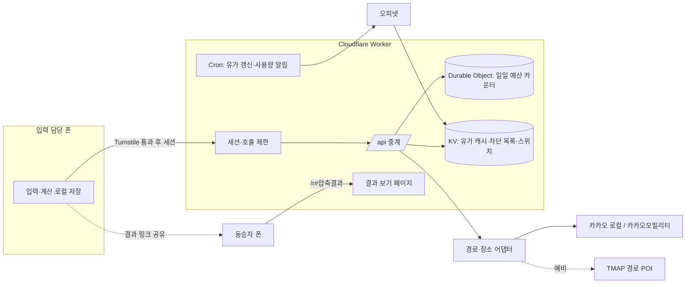

# 시스템 설계

> Worker, 서버 최소 정보, 0원 운영, 어뷰징 대응, 외부 연동, 데이터 모델, 예외 처리.

## 시스템 구성

서버는 Cloudflare Worker 하나입니다. 데이터베이스와 로그인 없이, 폰이 계산하고 Worker는 API 키를 숨긴 채 외부 API를 대신 호출합니다.

### 역할 분담

| 위치                 | 담당                                                              | 저장하는 것                                 |
|----------------------|-------------------------------------------------------------------|---------------------------------------------|
| **입력 담당 폰**     | 여행·구간·멤버 입력, 유류비·노동비·괘씸·정산 계산, 결과 링크 생성 | 여행 전체 기록, 유가 스냅샷(조회 시각 포함) |
| **Worker /api**      | API 키 보관, 카카오·오피넷 호출 중계, 응답 정리, 호출 제한        | 없음(응답 캐시만)                           |
| **Worker Cron**      | 하루 몇 차례 오피넷 시·도별 평균가를 받아 캐시 갱신               | KV에 시·도 × 유종 평균가 1건                |
| **결과 보기 페이지** | 링크의 \# 뒤 데이터를 풀어 영수증 표시                            | 없음(정적 파일)                             |

### 경로 제공자 어댑터

Worker 안에서 제공자별 응답을 같은 형식(구간별 거리, 시간, 통행료, 택시요금, 정체 비율, 저속 도로 비율)으로 바꿉니다. 앱은 어느 회사가 조회했는지 몰라도 됩니다.

| 상황                                | 동작                                        |
|-------------------------------------|---------------------------------------------|
| 평소                                | 카카오로 조회                               |
| 카카오 하드 상한(하루 9,000건) 도달 | TMAP으로 전환 (하루 900건 상한)             |
| 카카오 장애·앱 차단                 | 즉시 TMAP으로 전환, 비상 스위치로 고정 가능 |
| 둘 다 상한 도달                     | 자동 조회 중단, 수동 입력                   |

- 한 여행 안의 구간은 같은 제공자로 조회한다. 중간에 전환되면 그 여행 전체를 새 제공자로 다시 조회해 구간 간 기준을 맞춘다.
- 구간마다 조회 출처를 저장하고 계산 근거에 “조회: 카카오” 또는 “조회: TMAP”으로 표시한다. 두 회사의 택시요금·통행료 추정값은 조금 다를 수 있다.
- 정체 비율 계산은 제공자별 도로 교통 정보 형식에 맞춰 따로 구현한다.

### Worker API 명세 (초안)

| 엔드포인트                     | 입력                                                                      | 출력                                                                                                                          | 내부 동작                                                                                  |
|--------------------------------|---------------------------------------------------------------------------|-------------------------------------------------------------------------------------------------------------------------------|--------------------------------------------------------------------------------------------|
| `POST /api/session`            | Turnstile 토큰                                                            | 서명된 세션 토큰(2시간)                                                                                                       | Turnstile 검증 후 HMAC 서명 토큰 발급. 나머지 /api는 이 토큰 없으면 즉시 거절              |
| `GET /api/places`              | q(검색어)만                                                               | 장소 목록(이름, 주소, 좌표)                                                                                                   | 카카오 로컬 키워드 검색. 현재 위치 좌표는 받지 않음. 앱에서 입력 디바운스 필수             |
| `POST /api/route`              | 출발·도착 2점 좌표 (하차 장소를 고르면 그 지점 추가). 이름·날짜·인원 없음 | 구간별 거리, 시간, 통행료, 택시 예상요금, 정체·지체 거리 비율, 저속 원활 도로 비율. 2차: 지나는 고속도로 노선명과 노선별 거리 | 보통 여행 1건당 1회 호출. 하차 장소를 고른 경우에만 구간별로 추가 호출. 같은 좌표쌍은 캐시 |
| `GET /api/fuel/avg`            | sido(시·도 코드), prod(유종). 시·도는 폰이 주소 문자열에서 판단           | 평균가, 기준 시각                                                                                                             | KV에서 읽기만 함. 외부 호출 없음                                                           |
| `GET /api/fuel/stations` (2차) | 사용자가 고른 지점 좌표(소수점 2자리, 약 1km 단위로 뭉갬), 유종           | 주변 주유소와 가격                                                                                                            | 기기 현재 위치는 쓰지 않음. 오피넷 좌표계(KATEC)로 변환 후 조회, 10분 캐시                 |
| `/r#v1.…`                      | 링크 조각의 압축 결과                                                     | 영수증 화면                                                                                                                   | Worker 정적 자산으로 서빙                                                                  |

### 결과 링크 구조

    결과 JSON(멤버 이름, 구간 요약, 금액, 괘씸 항목 코드, 말투 코드, 운전자 송금 링크(허용 형식만), 발급 시각)
     → deflate 압축 → base64url 인코딩
     → https://도메인/r#v1.{인코딩 문자열}

링크의 `#` 뒤는 브라우저가 서버로 보내지 않아서, 누가 얼마를 냈는지가 Cloudflare 로그에도 남지 않습니다. 앞의 `v1`은 결과 형식이 바뀌어도 옛 링크를 계속 열기 위한 버전 표시입니다. 메신저 호환을 위해 인코딩 결과는 약 2,000자 이내를 목표로 하고, 넘으면 구간 상세를 빼고 사람별 합계만 담습니다.

결과별 카카오톡 썸네일 카드는 만들지 않습니다. 미리보기는 카카오 서버가 페이지를 읽어 만드는데 결과 데이터는 `#` 뒤에 있어 서버가 볼 수 없기 때문입니다. 대신 Web Share API의 본문에 앱이 문구를 넣습니다. 썸네일은 공통 이미지 하나입니다.

    [서울→강릉] 민수 님 운전 정산 도착 · 괘씸자 1명 감지됨 🚨
    {결과 링크}

단체방에서 민망하지 않도록 괘씸자는 이름 없이 인원수만 씁니다.

### 보안과 남용 방지

아래 “어뷰징 대응” 섹션에서 위협별로 정리합니다.

### 비용

Cloudflare 공식 문서(2026년 9월 확인) 기준 Workers 무료 플랜은 하루 10만 요청, 요청당 CPU 10ms이고, fetch 호출이나 KV 읽기를 기다리는 시간은 CPU 시간에 포함되지 않습니다. 이 앱의 Worker는 외부 API를 기다리는 시간이 대부분이라 CPU 한도에 걸릴 일이 적습니다. 정적 자산 요청은 무료이고 무제한이라 결과 페이지 조회는 요청 수에 들어가지 않고, Cron Trigger는 무료 플랜에서 계정당 5개까지라 유가 갱신 1개면 충분합니다. 유료 플랜은 월 최소 5달러입니다.

여행 한 건에 장소 검색·경로·유가 조회로 대략 15회 안팎의 요청을 쓴다고 보면 무료 한도로 하루 수천 건을 처리할 수 있습니다. 실제 병목은 Cloudflare보다 카카오모빌리티 길찾기 무료 호출량일 가능성이 높습니다(구간 수만큼 호출).

### 개발 초기에 확인할 위험

- 오피넷 API가 Cloudflare 해외 경유 IP의 호출을 막지 않는지 첫 주에 실제 호출로 확인. 막히면 유가 갱신만 국내 소형 서버나 GitHub Actions 예약 작업으로 옮긴다.
- 카카오모빌리티에 결제수단이 없을 때 무료량 초과분이 차단되는지 청구되는지(확인 전까지 하드 상한으로 방어).
- Rate Limiting 바인딩의 무료 플랜 사용 가능 여부.
- 오피넷 API 키의 일일 호출 제한과 서비스 이용 조건.
- 오피넷 KATEC 좌표 변환 정확도(주변 주유소 기능, 2차).

## 서버 최소 정보 원칙

서버는 주소 조회기일 뿐, 누가 누구와 어디를 갔는지는 모릅니다. 새 기능을 추가할 때 이 원칙에 어긋나면 기능 쪽을 바꿉니다.

### 서버가 받는 것

| 엔드포인트          | 받는 정보        | 받지 않는 것                                   |
|---------------------|------------------|------------------------------------------------|
| `POST /api/session` | Turnstile 토큰   | 기기 정보, 앱 식별자. 세션 ID는 무작위 값      |
| `GET /api/places`   | 검색어           | 현재 위치 좌표 (“현재 위치로 검색”은 MVP 제외) |
| `POST /api/route`   | 지점 좌표 목록   | 장소 이름, 여행 날짜, 인원, 멤버               |
| `GET /api/fuel/avg` | 시·도 코드, 유종 | 주소, 좌표                                     |

경로 조회의 좌표가 서버가 아는 최대치입니다. 좌표만으로는 그 경로를 누가 언제 누구와 갔는지 알 수 없습니다.

### 서버가 절대 받지 않는 것

멤버 이름, 금액, 괘씸·감면 기록과 메모, 주유 기록, 여행 날짜, GPS·속도 정보, 결과 링크 내용.

### 서버가 저장하는 것

| 저장소         | 내용                                   | 보관                                                                        |
|----------------|----------------------------------------|-----------------------------------------------------------------------------|
| Durable Object | 전체 호출 수, 세션 ID별 호출 수        | 하루 지나면 삭제. 세션 ID는 2시간 뒤 무효                                   |
| KV             | 유가 평균, 비상 스위치, 수동 차단 목록 | 차단 목록은 당일만 유효                                                     |
| 응답 캐시      | 경로·장소 응답                         | 캐시 키는 좌표·검색어를 비밀 값과 섞은 해시. 좌표 문자열이 캐시에 남지 않음 |
| 로그           | 오류 코드만                            | 요청 본문·검색어·좌표는 기록하지 않음                                       |

### 개발 규칙

- Worker 코드에서 요청 본문, 쿼리, 좌표를 `console.log`로 출력하지 않는다. 코드 리뷰 체크 항목.
- Workers 로그는 끄거나 오류 코드만 남기도록 설정한다.
- 운전 중 잠금(S8)의 속도 감지는 폰 안에서만 계산한다.
- 서버 기반 음성 인식을 쓰지 않는다. 음성이 외부 회사 서버로 전송되기 때문이다.
- 광고 스크립트는 정산 결과 화면(S10)의 광고 카드에서만 불러오고 결과 보기 페이지(/r)에는 넣지 않는다. 광고 요청에 이름·금액·목적지 같은 여행 정보를 넣지 않는다.
- 분당 호출 제한에는 IP를 키로 쓰지만 Cloudflare 제한 기능 안에서만 쓰이고 우리 저장소에 남기지 않는다.
- 외부 API(카카오, TMAP, 오피넷)는 Worker의 IP만 보게 되어 사용자 IP가 외부 회사에 전달되지 않는다.

## 0원 운영 원칙

출시와 초기 운영을 결제 0원으로 합니다. 돈이 나갈 수 있는 곳은 카카오모빌리티와 TMAP의 경로 조회 무료량 초과분뿐이므로, 이것을 코드로 막는 것이 핵심입니다.

1.  **결제수단을 등록하지 않는다.** Cloudflare, 카카오, TMAP 모두 무료 한도 안에서만 동작하게 둔다.
2.  **외부 API 호출은 모두 Worker의 일일 예산 카운터를 거친다.** 한도에 가까워지면 자동 조회를 끄고 수동 입력으로 넘긴다.
3.  **자동 조회가 없어도 앱이 완전히 동작한다.** 거리·시간·통행료·유가 직접 입력 경로를 MVP 품질로 만든다.

| 항목                         | 무료 범위 (2026년 9월 확인)                                                                            | 0원 유지 방법                                                                                                                           |
|------------------------------|--------------------------------------------------------------------------------------------------------|-----------------------------------------------------------------------------------------------------------------------------------------|
| Cloudflare Workers           | 하루 10만 요청, 요청당 CPU 10ms. 정적 자산 요청 무료·무제한                                            | 무료 플랜 유지. 한도 초과 시 오류로 끝나며 청구 없음                                                                                    |
| Durable Objects (SQLite)     | 무료 플랜 제공. 하루 10만 요청, 행 쓰기 10만                                                           | 일일 예산 카운터 전용으로만 사용                                                                                                        |
| Turnstile                    | 무료, 챌린지 무제한, 위젯 20개, 위젯당 호스트 10개                                                     | workers.dev 주소를 호스트로 등록                                                                                                        |
| 카카오모빌리티 자동차 길찾기 | 일 10,000건 무료, 초과분 건당 8원                                                                      | **하루 9,000건 하드 상한**, 좌표 캐시                                                                                                   |
| TMAP (예비)                  | Free 요금제: 자동차 경로안내 일 1,000건, POI 검색 일 20,000건. 초과분 경로안내 건당 11원(Premium 기준) | 경로 하루 900건, POI 하루 18,000건 하드 상한. 카카오 상한·장애 시에만 사용                                                              |
| 카카오 로컬 장소검색         | 일 최대 10만 호출 (월 통합 쿼터 별도)                                                                  | 과금보다 초과 시 차단 위험. 하루 50,000건 상한, 디바운스·캐시                                                                           |
| 오피넷                       | 무료, 키 신청                                                                                          | Cron에서만 하루 몇 차례 호출                                                                                                            |
| 정산 광고                    | 광고 네트워크 가입 무료                                                                                | 구글 애드센스는 자체 도메인이 필요할 가능성이 높아 도메인 구입(연 1만 원대)이 첫 지출이 될 수 있음. 카카오 애드핏은 매체 심사 통과 필요 |
| 교통 이력 요약표 (2차)       | GitHub Actions(공개 저장소), Worker 정적 자산                                                          | 원본 CSV 가공은 Worker가 아닌 GitHub Actions 예약 작업에서. 결과 JSON은 정적 파일로 배포(요청 무료·무제한)                              |
| 도메인                       | workers.dev 서브도메인 무료                                                                            | 도메인 구매는 수익이 생긴 뒤                                                                                                            |
| 지도 표시                    | —                                                                                                      | 지도 SDK 미사용. 경로 화면은 도식형 SVG                                                                                                 |
| 결과 공유                    | —                                                                                                      | 카카오톡 SDK 대신 브라우저 공유(Web Share API)와 링크 복사                                                                              |
| 앱 배포                      | PWA는 비용 없음                                                                                        | 스토어 등록(구글 1회 25달러, 애플 연 99달러)은 나중에                                                                                   |

무료 제공량은 각 사가 변경할 수 있다고 명시하고 있으므로 출시 직전과 분기마다 다시 확인합니다.

## 어뷰징 대응

로그인이 없고 서버가 공개 API를 중계하는 구조라, 누구든 앱 없이 Worker를 직접 두드릴 수 있습니다. 목표는 완벽한 차단이 아니라 “공격해도 돈이 나가지 않고, 정상 사용자는 수동 입력으로라도 정산을 끝낼 수 있게” 만드는 것입니다.

### 위협 목록

| ID  | 위협                                                 | 피해                                                                                 | 심각도                           |
|-----|------------------------------------------------------|--------------------------------------------------------------------------------------|----------------------------------|
| T1  | 스크립트로 경로·장소 API 반복 호출                   | 카카오 일일 무료량 소진, 정상 사용자 자동 조회 중단, 초과 과금 위험                  | 높음 |
| T2  | 다른 서비스가 우리 Worker를 무료 길찾기 API처럼 사용 | T1과 같음. 장기간 조용히 진행될 수 있음                                              | 높음 |
| T3  | 차단당할 요청이라도 대량으로 보내기                  | 거절 응답도 Worker 요청 수에 포함되어 하루 10만 소진 시 Worker 전체 오류             | 중간 |
| T4  | 카카오 운영정책 위반                                 | 쿼터 초과 이용·동일 서비스 복수 앱 운영 시 앱 차단                                   | 높음 |
| T5  | 결과 링크 위조·악용                                  | 임의 금액 링크로 송금 유도, 욕설 이름 노출, 스크립트 삽입, 압축 폭탄으로 페이지 멈춤 | 중간 |
| T6  | 입력 담당의 정산 조작                                | 운전 시간·통행료·괘씸 부풀리기로 친구 간 분쟁                                        | 낮음 |
| T7  | API 키 유출                                          | Worker를 거치지 않는 직접 호출로 쿼터 소진                                           | 중간 |

### 요청이 거치는 방어 순서

비용이 싼 검사를 앞에, 비싼 검사를 뒤에 둡니다. 앞 단계에서 거절되면 뒤 단계(DO 호출, 카카오 호출)는 실행되지 않습니다.

    ① 경로·메서드·입력값 검증        (CPU만 사용)
    ② 세션 토큰 서명·만료 확인        (CPU만 사용)
    ③ 차단 목록 확인                  (KV 읽기)
    ④ 분당 호출 제한                  (Rate Limiting 바인딩)
    ⑤ 응답 캐시 확인 → 적중 시 반환   (Cache API)
    ⑥ 일일 예산 차감                  (Durable Object)
    ⑦ 카카오 호출 → 응답 축소 → 캐시 저장

### 1. 세션 발급: 사람이 쓰는 앱인지 확인 (T1, T2)

- 앱을 처음 열 때 Turnstile(보이지 않는 모드)을 실행하고, 토큰을 `POST /api/session`으로 보낸다.
- Worker는 Turnstile 검증에 통과하면 세션 ID, 만료 시각(2시간)을 HMAC으로 서명한 토큰을 준다. 이후 모든 /api 요청은 이 토큰이 필요하다.
- 토큰 검증은 서명 계산만 하므로 외부 호출 없이 끝난다. 위조·만료 토큰은 ②에서 즉시 401.
- 세션 발급 자체도 IP당 10분에 5회로 제한해 세션 대량 생성을 막는다.
- Turnstile 위젯 호스트에는 서비스 주소만 등록하므로, 다른 사이트에 위젯을 심어 세션을 받아가는 방식은 통하지 않는다.

### 2. 호출량 제한: 세션·IP·전체 3단 (T1, T2, T4)

| 단위                       | 경로 조회 `/api/route` | 장소검색 `/api/places` | 구현                                                  |
|----------------------------|------------------------|------------------------|-------------------------------------------------------|
| 세션 분당                  | 5회                    | 30회                   | Rate Limiting 바인딩                                  |
| IP 분당                    | 15회                   | 90회                   | Rate Limiting 바인딩 (공용 와이파이 고려해 여유 있게) |
| 세션 하루                  | 40회                   | 300회                  | Durable Object 카운터                                 |
| 전체 시간당                | 1,500건                | 8,000건                | Durable Object. 오전에 하루치가 다 타버리는 것 방지   |
| 전체 하루 (하드 상한)      | 9,000건                | 50,000건               | Durable Object. 넘으면 카카오를 절대 호출하지 않음    |
| TMAP 예비 하루 (하드 상한) | 900건                  | 18,000건               | Durable Object. 카카오 상한 도달·장애 시에만 사용     |

Rate Limiting 바인딩은 Cloudflare 위치별로 대략 세는 방식이라 순간 폭주를 싸게 거르는 용도로 쓰고, 돈과 직결되는 일일 상한은 정확히 세는 Durable Object에 맡깁니다. 세션 하루 40회는 구간 4개짜리 여행을 10번 조회할 수 있는 양으로, 정상 사용자는 닿지 않습니다.

### 3. 단계별 절전 모드 (T1, T2)

| 일일 사용률           | 동작                                                 | 앱 표시                             |
|-----------------------|------------------------------------------------------|-------------------------------------|
| 0~70%                 | 정상                                                 | —                                   |
| 70~90%                | 세션 하루 한도 절반으로, 장소검색 최소 글자 수 2 → 3 | —                                   |
| 90~100%               | 새 카카오 호출 중단, 캐시 적중과 TMAP 예비로 응답    | —                                   |
| 카카오·TMAP 모두 100% | 자동 조회 엔드포인트 즉시 503                        | 같은 문구, 수동 입력 필드 자동 펼침 |

### 4. 훔쳐 갈 가치 낮추기 (T2)

- **응답 축소:** 경로 응답은 구간별 거리·시간·통행료·택시요금과 난이도용 비율 2개, 숫자 6개만(2차에 고속도로 노선명·거리 추가, 개인 정보 아님). 비율은 Worker가 도로별 교통 정보로 계산한 뒤 원본을 버린다. 경로 좌표(vertexes), 도로별 정보는 내보내지 않는다. 내비·배달 서비스가 대신 쓰기에 쓸모없게 만든다.
- **장소검색 축소:** 상위 5개, 이름·주소·좌표만. 전화번호·카테고리·페이지 넘김은 제공하지 않는다.
- **입력 제한:** 좌표는 대한민국 영역 안, 지점 최대 11개(구간 10개), 검색어 2~40자. 벗어나면 400.
- **캐시:** 좌표를 소수점 4자리(약 10m)로 반올림한 뒤 비밀 값과 섞어 해시한 값을 캐시 키로 사용. 같은 구간 반복 조회는 카카오를 부르지 않는다.

### 5. Worker 요청 한도 방어 (T3)

- 거절 경로(①~④)는 외부 호출 없이 1ms 안에 끝나게 유지해 CPU 한도에 걸리지 않게 한다.
- Worker 요청 한도가 소진돼도 서비스가 멈추지 않게 설계한다. 앱 화면은 서비스 워커로 폰에 캐시되고, 계산·기록·결과 링크 생성은 서버 없이 동작한다. 결과 보기 페이지도 브라우저에서만 해석한다.
- 정적 자산은 Worker 코드보다 먼저 응답하도록 설정한다. 요청 한도 소진 시 정적 자산 응답이 유지되는지는 배포 후 실제로 확인한다.
- 도메인을 사게 되면(수익 발생 후) Worker 실행 전 단계인 WAF 차단 규칙으로 옮겨 요청 수 소모 자체를 줄인다.

### 6. 감시와 비상 스위치 (T1~T4, T7)

- **알림:** Cron이 매시 정각 Durable Object 카운터를 읽어 사용률 50%, 80%, 95%에서 디스코드 또는 텔레그램 웹훅으로 알림(무료).
- **이상 징후:** 세션 하루 한도에 닿은 세션 수를 알림에 포함. 한도에 닿는 세션이 10개를 넘으면 공격 의심 알림. IP는 저장하지 않으므로 공격자별 분석은 하지 않는다.
- **비상 스위치:** KV에 `auto_route`, `auto_places` 켜기/끄기 값. 재배포 없이 대시보드에서 바로 끈다.
- **차단 목록:** KV에 세션 ID, 그날만 쓰는 솔트로 해시한 IP. 수동 등록만 하고 당일에 만료. KV 쓰기 한도에 걸리지 않는다.
- **키 유출 대응:** 카카오·오피넷 키 재발급 → `wrangler secret put`으로 교체 → 옛 키 폐기. 절차를 운영 문서에 적어 둔다.

### 7. 제공자 운영정책 지키기 (T4)

- 카카오 앱은 하나만 만든다. 개발용·운영용으로 앱을 나누거나 쿼터를 늘리려 앱을 추가하지 않는다(동일 서비스 복수 앱 운영은 차단 사유).
- 개발·테스트는 저장해 둔 샘플 응답(목업 데이터)으로 하고, 실제 키 호출은 통합 테스트 때만.
- 일일 하드 상한을 카카오·TMAP 무료량보다 낮게 둬서 쿼터 초과 이용이 구조적으로 발생하지 않게 한다.
- 카카오 앱이 차단되더라도 TMAP 예비로 전환되어 서비스가 멈추지 않는다. TMAP도 계정·앱을 하나만 운영한다.

### 8. 결과 링크 악용 막기 (T5)

- **형식 검증:** 링크 데이터 최대 4KB, 압축 해제는 32KB에서 중단. 멤버 10명, 구간 10개, 이름 10자, 금액 0~500만원 범위를 벗어나면 “손상된 링크” 화면.
- **자유 텍스트 최소화:** 괘씸 사유는 항목 코드로만 전달하고 문구는 페이지가 가진 고정 문장으로 표시. “기타” 항목의 메모는 링크에 넣지 않는다. 자유 입력은 이름뿐이다.
- **안전한 표시:** 모든 값은 텍스트로만 출력(HTML 해석 금지). 링크 데이터 안의 URL은 절대 링크로 만들지 않는다. 결과 페이지에 엄격한 CSP 적용.
- **송금 유도 차단:** 결과 링크에는 계좌번호 원문을 절대 넣지 않는다. 송금 버튼은 토스 아이디 링크, 카카오페이 송금 링크처럼 정해진 형식의 주소만 허용하고, 결과 페이지가 표시 전에 형식을 다시 검증한다. 버튼 옆에 “송금 앱에서 받는 사람이 ○○ 님인지 확인하세요”를 둔다. 결과 페이지 고정 문구: “유가 시세, 최저시급, 함께 확인한 괘씸 기록으로 자동 계산했어요. 금액은 링크를 만든 사람이 입력한 값 기준이니 송금 전에 확인하세요.” 입력 담당의 부담을 덜면서 사실과 어긋나지 않게 한다.
- **서명은 하지 않는다:** 서명하려면 결과 내용이나 해시를 서버로 보내야 해서 서버 최소 정보 원칙에 어긋난다. 서명은 “앱에서 계산했다”는 증명일 뿐 입력값이 사실이라는 증명도 아니므로, 고정 안내 문구로 대신한다.

### 9. 정산 조작 드러내기 (T6)

한 폰 입력 구조에서는 입력 담당이 값을 바꾸는 것을 막을 수 없습니다. 대신 결과에서 보이게 합니다.

- 자동 조회값을 직접 수정한 항목은 결과 영수증 계산 근거에 원래 값과 함께 표시. 예: “운전 시간 직접 입력: 예상 1시간 → 2시간”
- 직접 입력한 운전 시간이 자동 조회 예상의 1.5배를 넘으면 결과 페이지에 주의 표시. 조회 시점 교통 기준이라 부정확할 수 있어, 고속도로 구간은 2차에서 10번의 평소 이력 기준 판정으로 대체한다.
- 괘씸 배수 상한 2.0, 난이도 계수 상한 2.0 유지. 직접 입력한 실제 운전 시간·기상·체감 점수는 영수증에 “직접 입력”으로 표시. 결과에 택시 예상요금을 함께 보여줘 비상식적인 금액이 한눈에 드러나게 한다.

### 10. 공공 교통 이력으로 운전 시간 검증하기 (T6, 2차)

“금요일 저녁이라 막혔다”는 입력이 사실에 가까운지, 동승자가 판단할 근거를 줍니다. 서버는 여행 시각을 전혀 알지 못하고 비용도 들지 않습니다.

1.  **이력 수집 (GitHub Actions)**주 1회 예약 작업이 한국도로공사 VDS 소통 통계를 받아 “고속도로 노선 × 방향 × 요일 × 시간대 → 평소 평균 속도, 정체 빈도” 요약표(JSON)를 만든다. 원본은 크고 무거우므로 Worker에서 처리하지 않는다.
2.  **정적 배포**요약표를 Worker 정적 자산으로 배포한다. 폰은 필요할 때 한 번 내려받아 캐시한다.
3.  **노선 정보 받기**`/api/route`가 구간마다 지나는 고속도로 노선명과 노선별 거리를 추가로 돌려준다. 카카오 응답의 도로 이름으로 Worker가 계산하고 원본은 버린다.
4.  **폰 안에서 비교**폰이 출발 시각과 노선으로 요약표를 조회해 “평소 이 시간대 예상 소요 시간”을 계산한다. 시각은 서버로 가지 않는다.
5.  **결과에 표시**입력한 실제 운전 시간과 평소 예상을 나란히 보여준다.

| 판정               | 조건                                                     | 결과 영수증 표시                                                                      |
|--------------------|----------------------------------------------------------|---------------------------------------------------------------------------------------|
| 평소 혼잡 시간대   | 입력 시간이 평소 예상의 1.3배 이내                       | “금요일 저녁 영동고속도로는 평소에도 느린 시간대예요. 입력한 운전 시간과 비슷해요.”   |
| 평소보다 오래 걸림 | 평소 예상의 1.3~2배                                      | “평소보다 오래 걸렸어요. 사고·공사·날씨 영향일 수 있어요.” (중립)                     |
| 확인 필요          | 평소 예상의 2배 초과                                     | 확인 필요 “평소 이 시간대의 2배 넘게 걸렸다고 입력됐어요.” |
| 판정 불가          | 고속도로 비중이 구간 거리의 50% 미만, 요약표에 없는 노선 | 표시하지 않음                                                                         |

- 판정은 정산 금액을 바꾸지 않는다. 금액은 입력값 그대로 계산하고 판단은 사람에게 맡긴다.
- “확인 필요”도 비난하는 문구를 쓰지 않는다. 실제 사고나 폭설은 이력 평균으로 설명되지 않는다.
- 도심 도로는 지자체마다 데이터 형식이 달라 판정하지 않는다.

### MVP에 넣을 것과 미룰 것

| MVP 필수                                                                                                                                                                | 2차                                                                                                              |
|-------------------------------------------------------------------------------------------------------------------------------------------------------------------------|------------------------------------------------------------------------------------------------------------------|
| 입력값 검증, 세션 토큰(Turnstile), 분당 제한, 일일 하드 상한, 응답 축소, 좌표 캐시, 비상 스위치, 사용률 알림, 결과 링크 형식 검증·텍스트 출력·안내 문구, 직접 입력 표시 | 시간당 예산·단계별 절전 모드 세분화, 공공 교통 이력 기반 운전 시간 검증(조작 의심 표시), 도메인 구매 후 WAF 이전 |

## 외부 연동 검토

<table>
<colgroup>
<col style="width: 33%" />
<col style="width: 33%" />
<col style="width: 33%" />
</colgroup>
<thead>
<tr class="header">
<th>용도</th>
<th>후보</th>
<th>확인할 점</th>
</tr>
</thead>
<tbody>
<tr class="odd">
<td>유가(평균가·주유소별 가격)</td>
<td>오피넷(한국석유공사) 오픈 API</td>
<td>API 키 발급, 호출 한도, 주유소 가격 갱신 주기, 상업적 이용 조건</td>
</tr>
<tr class="even">
<td>경로·거리·시간·통행료·택시요금</td>
<td><strong>주력</strong> 카카오모빌리티 자동차 길찾기 (일 10,000건 무료) 
<strong>예비</strong> TMAP 자동차 경로안내 (Free 요금제 일 1,000건)</td>
<td>두 회사 모두 택시요금·통행료 응답 포함. 제공자별 도로 교통 정보 형식 차이, 응답 캐시 허용 범위</td>
</tr>
<tr class="odd">
<td>검토 후 제외</td>
<td>네이버 클라우드 Maps, 구글 지도, 오픈소스 경로 엔진(OSM)</td>
<td>네이버: 무료량·결제수단 조건이 0원 원칙과 충돌, 경유지 5개 제한. 구글: 한국 자동차 길찾기 제공 시기 불확실, 결제 계정 필요. OSM: 경로 서버 직접 운영 필요, 실시간 교통·택시요금·통행료 없음</td>
</tr>
<tr class="even">
<td>장소 검색</td>
<td><strong>주력</strong> 카카오 로컬 키워드 검색 
<strong>예비</strong> TMAP POI 검색, 주소는 행정안전부 도로명주소 API</td>
<td>휴게소·주유소 검색 품질, 예비 전환 시 결과 형식 통일</td>
</tr>
<tr class="odd">
<td>결과 공유</td>
<td>Web Share API, 링크 복사</td>
<td>카카오톡 SDK 미사용. 공유 본문 문구는 앱이 직접 작성</td>
</tr>
<tr class="even">
<td>송금</td>
<td>토스·카카오페이 송금 링크</td>
<td>딥링크 방식, 금액 prefill 가능 여부</td>
</tr>
<tr class="odd">
<td>영수증 인식 (P1)</td>
<td>OCR API</td>
<td>주유 영수증 단가·주유량 추출 정확도</td>
</tr>
<tr class="even">
<td>고속도로 소통 이력 (2차)</td>
<td>한국도로공사 VDS 지점별 소통 통계(1시간 단위 CSV), 교통 빅데이터 플랫폼 전체 데이터</td>
<td>로그인 다운로드 조건, 이용허락 범위, 갱신 주기. 파일이라 API 호출량 제한 없음</td>
</tr>
<tr class="odd">
<td>출발 전 예측 대안 (검토)</td>
<td>국가교통정보센터 교통예측정보(고속도로·국도 예상 속도)</td>
<td>표준노드링크 매칭 필요, 공공데이터포털 개발·운영계정 트래픽. MVP는 카카오가 구현이 간단</td>
</tr>
<tr class="even">
<td>도심 도로 소통 (보류)</td>
<td>서울 TOPIS 등 지자체별 소통 정보</td>
<td>도시마다 형식이 달라 전국 적용 어려움</td>
</tr>
</tbody>
</table>

## 데이터 모델

모든 데이터는 입력 담당의 폰(브라우저 IndexedDB 또는 앱 로컬 DB)에만 저장합니다. 서버에는 여행 기록이 남지 않습니다.

| 엔티티        | 주요 필드                                                                                                                                                                                                                                              |
|---------------|--------------------------------------------------------------------------------------------------------------------------------------------------------------------------------------------------------------------------------------------------------|
| Trip          | id, 제목, 출발 탭 시각, 도착 탭 시각, 출발지·도착지, 경로 요약(거리·예상 시간·통행료·택시요금), 빠른 정산 여부, 차량 id, 노동비 방식, 기준 시급, α, 괘씸모드 on/off, 괘씸 방식(가산/재분배), 상태                                                      |
| Vehicle       | id, 차주 멤버 id, 유종, 연비(기본 12km/L, 기본값 여부), 탱크 용량                                                                                                                                                                                      |
| Member        | id, trip id, 이름(미입력 시 동승자 A…), 차주 여부, 추정 좌석                                                                                                                                                                                           |
| Segment       | id, trip id, 순서, 출발/도착 좌표, 거리, 예상 시간, 실제 운전 시간, 정차 시간, 출발·도착 시각, 통행료, 주차비, 택시 예상요금, 정체·지체 거리 비율, 저속 원활 도로 비율, 기상 체크, 체감 점수, 난이도 계수, 경로 조회 출처(카카오/TMAP), 운전자 멤버 id |
| TripEvent     | id, trip id, 종류(하차·합류·운전 교대·휴식 시작·휴식 종료), 시각, 대상 멤버, 장소(선택). Segment와 SegmentRider는 이 기록에서 자동 생성                                                                                                                |
| SegmentRider  | segment id, member id, 좌석(조수석/뒷자리/미지정), 자동 생성                                                                                                                                                                                           |
| FuelLog       | id, trip id, 구간 id, 주유소 id·이름, 단가, 주유량, 결제자, 영수증 이미지                                                                                                                                                                              |
| PriceSnapshot | id, trip id, 조회 시각, 지역, 유종, 평균가, 출처                                                                                                                                                                                                       |
| PenaltyEvent  | id, segment id, 대상 멤버, 항목 코드, 점수, 메모(기타 항목, 폰에만 저장), 기록 시각, 확정 여부, 용서 여부                                                                                                                                              |
| Payment       | id, trip id, 결제자, 항목(유류/통행/주차), 금액                                                                                                                                                                                                        |
| Settlement    | trip id, 보내는 사람, 받는 사람, 금액, 결과 링크 발급 시각                                                                                                                                                                                             |

## 정책과 예외 처리

- **안전:** 입력 담당이 현재 구간 운전자로 지정되어 있고 이동 속도가 감지되면 입력을 막고 “도착 후 기록하세요”를 띄운다. 속도 계산은 폰 안에서만 한다.
- **자동 조회 한도 도달:** 화면을 막는 팝업 대신 입력 필드 위 안내 문구와 수동 입력 필드 자동 펼침. 차 안에서 쓰는 앱이므로 흐름을 끊지 않는다.
- **운전 교대:** 여행 중 “운전 교대” 버튼으로 새 운전자를 탭하면 그 시각에 구간이 나뉜다. 깜빡했으면 도착 후 타임라인에서 추가한다.
- **앱을 못 켠 여행:** 홈의 “빠른 정산”에서 도착지·인원·출발/도착 시각만으로 정산한다. 괘씸·결제 기록은 결과 화면에서 추가할 수 있다.
- **차주가 운전하지 않는 경우:** 노동비는 운전자에게, 차량 감가(P2)는 차주에게 따로 지급.
- **연비 모름:** 차종 공인연비 사용, 주유 기록이 2회 이상 쌓이면 실측 연비 제안.
- **유가 API 장애:** 마지막 성공 스냅샷 사용, 결과에 “기준 시각”을 명시.
- **괘씸모드 과열 방지:** 배수 상한 2.0, 한 사람이 받는 괘씸 가산액이 본인 기본 노동비 분담액을 넘지 않게 제한. 여행 생성자가 끌 수 있음.
- **재계산:** 입력을 수정하면 즉시 재계산. 결과 링크는 발급 시점 결과를 담으므로, 확정 후 수정하면 새 링크를 다시 공유한다. 결과 페이지에 발급 시각을 표시해 옛 링크와 구분한다.
- **중간 하차·합류:** 여행 중 “하차·합류” 버튼으로 사람과 시각만 폰에 기록한다. 도착 후 타임라인에서 그 시각을 경계로 구간이 나뉘고, 장소는 검색으로 고르거나 고르지 않으면 운전 시간 비율로 거리를 나눈다. 지도 핀이나 현재 위치는 쓰지 않는다.
- **선결제:** 동승자가 휴게소에서 기름값·통행료를 냈다면 결제 기록에 결제자로 남긴다. 정산은 사람별 “낸 돈 − 자기 몫”으로 차액을 계산해 최소 송금 목록을 만든다.
- **폰 분실·앱 삭제:** 서버에 기록이 없으므로 복구되지 않는다. 여행 내보내기(파일 백업)를 P1로 제공한다.
