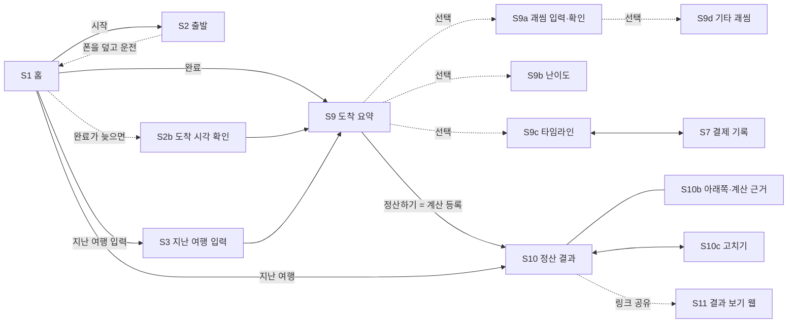

# 화면 명세

> 사용성 원칙과 화면별 동작 규칙. 시각 참고는 mockups/final.html.

## 사용성 원칙

차 안, 친구 사이, 돈 이야기라는 세 조건에서 쓰기 쉽고 민망하지 않아야 합니다.

| 원칙                               | 적용                                                                                          |
|------------------------------------|-----------------------------------------------------------------------------------------------|
| 출발 전 입력은 2개                 | 도착지와 동승자만. 구간·운전자·좌석은 기록에서 자동, 차량·규칙은 기본값(S2)                   |
| 고치기는 결과를 보면서             | 결과 화면에서 값을 고치면 금액이 바로 바뀜. 무엇이 기본값인지 표시(S10c)                      |
| 운전 전후로 한 번씩만 탭           | 출발 “시작”, 도착 “완료”. 나머지는 전부 도착 후 입력                                          |
| 운전 중에는 화면을 보지 않는다     | 주행 중 기록 화면을 두지 않는다. 시작·완료 시각만 앱이 잰다                                   |
| 보내는 사람이 민망하지 않게        | 말투 3종(기본 순한맛), 명분 문구                                                              |
| 받는 사람은 3초 안에 금액 확인     | 결과 페이지(S11)는 사람별 금액부터. 설치·로그인 없음. 송금 버튼(등록 시)                      |
| 변수는 시각만 넣으면 계산이 따라온다 | 타임라인에 하차·합류·교대 시각 → 구간 자동 분할. 휴식 분 → 운전 시간 제외. 결제 기록 → 낸 돈 차감 |
| 밤에는 어둡게                      | 폰 다크 모드 또는 18~06시 야간 모드. 검정 배경, 낮은 밝기                                     |

### 입력 최소화

| 단계                    | 필수 입력                                | 선택                                              |
|-------------------------|------------------------------------------|---------------------------------------------------|
| 출발 (S1·S2)            | “시작” 탭                                | —                                                 |
| 운전 중                 | 없음                                     | 없음                                              |
| 도착 (S1)               | “완료” 탭                                | 늦게 눌렀으면 도착 시각 입력(S2b)                 |
| 도착 후 (S9)            | 도착지, 인원, “정산하기” 탭              | 기상·체감 칩, 괘씸(S9a), 타임라인(S9c), 난이도(S9b) |
| 결과 (S10)              | “결과 링크 공유” 탭                      | 말투, 고치기(S10c)                                |
| 시작을 못 누른 여행(S3) | 도착지, 인원, 출발·도착 시각, “정산하기” | 휴식 시간                                         |

필수 탭은 여행 한 건에 약 4회입니다. 시작·완료만 누르고 도착지·인원만 넣으면 정산이 됩니다.

#### 기본값

| 항목               | 기본값                             | 바꾸는 곳                   |
|--------------------|------------------------------------|-----------------------------|
| 출발지             | 최근 출발지 또는 저장한 “집”       | S2                          |
| 운전자·좌석        | 차주(나), 좌석 미지정              | 도착 후 타임라인에서 운전 교대·좌석 |
| 차량 유종·연비     | 휘발유, 12km/L (한 번 고치면 기억) | S10c                        |
| 노동비 방식·시급   | 시급형, 해당 연도 최저시급         | S10c                        |
| 괘씸모드·반영 방식 | 켜짐, 가산형                       | 설정                        |
| 말투               | 순한맛                             | S10                         |
| 기상·체감          | 맑음, 보통                         | S9 칩                       |
| 동승자 이름        | “+1명”이면 동승자 A, B…            | S10c                        |

결과 영수증에는 기본값으로 계산한 항목(연비, 시급 등)에 “기본값” 표시를 붙여 받는 사람도 추정치임을 알 수 있게 합니다.

#### 감수하는 점

- 경유지를 미리 넣지 않아 경로 조회는 출발지→도착지 한 번이다. 크게 돌아간 여행은 거리가 짧게 잡힐 수 있어 결과 화면에서 거리 고치기를 안내한다.
- 하차 장소를 고르지 않으면 구간 거리는 운전 시간 비율 추정이다.
- 첫 여행은 기본 연비라 기름값이 실제와 다를 수 있다. 한 번 고치면 다음부터 정확해진다.
- 구간마다 경로를 조회하지 않아 카카오 API 호출이 줄어, 0원 운영에는 유리하다.

### 영수증 말투

말투는 영수증 제목, 괘씸 사유 문장, 공유 본문, 명분 문구만 바꿉니다. 금액과 “송금 전에 확인하세요” 안내는 모든 말투에서 같습니다.

| 말투          | 괘씸 사유 예                                 | 공유 문구 예                     | 명분 문구                                               |
|---------------|----------------------------------------------|----------------------------------|---------------------------------------------------------|
| 순한맛 (기본) | 조수석에서 푹 쉬었어요 (+3)                  | 강릉 여행 운전 정산이 도착했어요 | 이 정산금은 운전자의 다음 기름값과 허리 건강에 쓰입니다 |
| 매운맛        | 조수석에서 60분 숙면. 내비는 누가 봤죠? (+3) | 괘씸자 1명 감지됨 🚨 정산 도착   | 운전자는 오늘 사람이 아니라 내비였습니다                |
| 비즈니스      | 조수석 휴식 60분 (+3)                        | 강릉 이동 운전 정산 내역입니다   | 표시하지 않음                                           |

### 음성 기록 (2차 조건)

- 기기 내부 음성 인식이 가능한 환경에서만 켠다. 서버 기반 인식은 음성이 외부로 전송되므로 쓰지 않는다.
- 계속 듣지 않고, 버튼을 누르는 동안만 듣는다. 동승자가 누르는 것을 기본으로 한다.
- “괘씸 태호 시끄러움”처럼 정해진 짧은 명령만 기록하고, 확인은 도착 후 S9에서 한다. 운전 중 확인 화면은 띄우지 않는다.

### 송금 버튼 (출시 직후)

- 운전자가 자기 토스 아이디 링크나 카카오페이 송금 링크를 한 번 등록하면 폰에 저장되고 결과 링크에 담긴다.
- 허용 형식이 아닌 주소, 계좌번호 원문은 저장·표시하지 않는다.
- 금액 자동 입력이 안 되는 경우를 대비해 “금액 복사” 버튼을 함께 둔다.

## MVP 화면 범위

1부 서비스 기획과 2부 시스템·운영 설계를 기준으로 합니다. 한 폰 입력 구조라 로그인, 멤버 초대, 투표 화면은 없고, 서버 최소 정보 원칙에 따라 기기의 현재 위치를 서버로 보내는 화면도 없습니다. 입력 담당은 안드로이드 앱, 링크를 받은 동승자는 웹 결과 페이지만 엽니다. **앱은 출발할 때 “시작”, 도착해서 “완료”를 누르는 미터기 방식이고, 운전 중에는 화면을 보지 않습니다.**

| ID   | 화면                  | 목적                                      | 핵심 요소                                                                                            |
|------|-----------------------|-------------------------------------------|------------------------------------------------------------------------------------------------------|
| S1   | 홈                    | 시작·완료, 지난 여행                      | 큰 “시작” 버튼(또는 진행 중이면 “완료”), 작은 “지난 여행 입력”, 지난 여행 목록                       |
| S2   | 출발 (시작)           | 출발 시각 기록                            | 확인 한 번, 시작 시각 표시. 다른 입력 없음                                                           |
| S2b  | 도착 시각 확인        | 완료를 늦게 눌렀을 때 도착 시각 받기      | “언제 도착했어요?”, 시각 입력, 시작 시각은 앱이 잰 값 그대로                                         |
| S3   | 지난 여행 입력        | 시작을 못 누른 여행을 사후 입력           | 도착지, 인원, 출발·도착 시각, 휴식                                                                   |
| S7   | 결제 기록             | 누가 무엇을 냈는지 반영 (도착 후)         | 종류(주유·통행료·주차·기타), 금액, 결제한 사람, 주유 단가·주유량                                     |
| S9   | 도착 요약             | 자동 계산값 한 장 확인 후 정산            | 운전 시간·인원·괘씸·난이도 요약, 기상·체감 칩(선택), 상세 보기 링크, 정산하기                        |
| S9a  | 괘씸 입력·확인 (선택) | 도착 후 괘씸·감면을 넣고 이의를 반영      | 구간·대상 선택, 괘씸·감면 타일(구간당 2회), 조수석 수면 분 입력, 체크 해제, 용서하기                 |
| S9d  | 기타 괘씸 (선택)      | 점수표에 없는 괘씸 행동 기록              | 대상, 메모(폰에만 저장), 구간당 남은 횟수                                                            |
| S9b  | 난이도 상세 (선택)    | 난이도 요소 확인·수정                     | 자동 운전 시간, 기상, 체감, 요소별 가산, 노동비 비교                                                 |
| S9c  | 여행 타임라인 (선택)  | 자동 생성된 구간 확인·보완                | 시각별 하차·합류·교대·결제, 하차 장소 선택, 기록 추가                                                |
| S10  | 정산 결과             | 누가 누구에게 얼마 보낼지 확인·공유       | 받을 돈(큰 글자), 말투 선택, 명분 문구, 사람별 보낼 돈, 기본값 안내·고치기, 결과 링크 공유           |
| S10b | 정산 결과 · 아래쪽    | 계산 근거 확인                            | 구간별 계산 근거, 낸 돈·몫·차액                                                                      |
| S10c | 고치기                | 결과를 보면서 값 수정                     | 이름, 운전 시간, 거리, 연비, 시급, 유가, 기상 · 기본값/자동/직접 입력 표시                           |
| S11  | 결과 보기(웹)         | 링크 받은 사람이 앱 없이 확인             | 사람별 금액 목록(큰 글자), 계산 근거 펼치기, 송금 버튼(등록 시), 받는 사람 확인 안내, 고정 안내 문구 |

## 화면 흐름

필수 경로는 시작(S2) → 완료 → S9 → S10, 필수 탭은 약 4회입니다. 운전 중에는 아무것도 누르지 않습니다. 점선으로 이어진 화면은 필요할 때만 엽니다.

## 화면별 동작 규칙

### — 시작 —

#### S1 홈

앱을 열면 가장 큰 버튼 하나가 보입니다. 아직 시작하지 않았으면 “시작”, 이미 시작했으면 “완료”입니다. 운전 전후로 각각 한 번씩만 누르면 됩니다.

##### 동작

- “시작” 탭 → S2(출발 시각 기록). 진행 중이면 같은 자리에 “완료”와 경과 시간이 보입니다.
- “완료” 탭 → 도착 시각을 지금으로 기록하고 S9 도착 요약. 시작한 지 오래됐으면 S2b를 먼저 엽니다.
- 작은 “지난 여행 입력 ›” → S3. 시작을 못 눌렀거나 남의 차를 탔던 여행용입니다.
- 지난 여행 탭 → S10(결과 다시 보기, 링크 재공유). 길게 누르기 → 복제·삭제
- 진행 중 여행은 한 번에 하나만.

##### 빈 상태

“출발할 때 시작을 누르고 폰을 덮으세요. 도착해서 완료만 누르면 정산해 드려요.”와 시작 버튼.

#### S2 출발 (시작)

버튼 하나짜리 화면입니다. 도착지·동승자·경로를 여기서 묻지 않습니다. 출발 직전에 입력을 요구하면 누르지 않게 됩니다.

##### 동작

- 시작 시각을 기록하고 바로 홈으로 돌아갑니다. 기록은 즉시 폰에 저장돼 앱이 꺼져도 남습니다.
- 화면에는 “시작했어요. 도착해서 완료만 누르세요”와 시작 시각만 표시합니다.
- 도착지·인원·괘씸·결제는 전부 도착 후에 넣습니다. 경로·유가 조회도 도착지를 고르는 시점(S9·S9c)에 합니다.
- 운전 중에는 알림도 진동도 보내지 않습니다. 백그라운드에서 도는 것이 없습니다.

#### S2b 도착 시각 확인

완료를 깜빡하고 한참 뒤에 앱을 열었을 때만 나옵니다. 시작 시각은 앱이 잰 값을 그대로 쓰고, 도착 시각만 사람에게 묻습니다.

##### 동작

- 시작 후 6시간이 지나 완료를 누르면 “언제 도착했어요?”를 한 번 묻습니다.
- 기본값은 지금 시각. 날짜·시각을 바꿀 수 있고 “도착 > 출발”만 검증합니다.
- 자동으로 시간을 잘라내지 않습니다. 사람이 넣은 시각 그대로 계산합니다.
- 홈의 진행 중 카드에도 6시간이 지나면 “아직 진행 중이에요. 도착 시각을 넣어 주세요”를 표시합니다.

#### S3 지난 여행 입력

시작을 못 누른 여행을 위한 입구입니다. 기록이 없다는 이유로 정산을 포기하지 않게 합니다.

##### 동작

- 필수 값: 도착지, 인원, 출발·도착 시각. 출발지는 최근 출발지 또는 저장한 “집”이 기본값
- 인원은 스테퍼. 이름 대신 동승자 A, B, C로 생성, 운전자는 나
- 시각은 오늘 기준, 날짜를 바꾸면 지난 날짜도 가능. 휴식은 칩 3개 중 선택
- “정산하기” → 경로 1회 조회 후 S9·S10
- 이렇게 들어온 여행의 운전 시간은 결과에 “직접 입력”으로 표시합니다(앱이 잰 값과 구분)

### — 도착 후 입력 —

#### S7 결제 기록

S9c 타임라인과 S10c 고치기에서 여는 바텀시트입니다. 도착 후에 넣습니다. 기름값뿐 아니라 통행료·주차비를 동승자가 먼저 낸 경우까지 한곳에서 받습니다.

##### 동작

- 종류 탭: 주유는 주유소·단가·주유량(또는 금액), 통행료·주차·기타는 금액과 메모만
- 결제한 사람은 필수. 정산에서 사람별 “낸 돈 − 자기 몫”으로 차액을 계산해 최소 송금 목록을 만듦
- 주유소는 검색어로 찾거나 직접 입력. 현재 위치로 자동 채우지 않음
- 주유 단가는 이후 구간 유류비에 적용. 정밀 모드(탱크 잔량 가중평균)는 설정에서 켤 때만
- 기록은 S9c 타임라인에 “💳 주유 49,500원 · 민수 결제”로 표시

#### S9 도착 요약

홈의 “완료” 한 번으로 열리는 화면입니다. 앱이 잰 시간을 보여주고, 여기서 도착지와 인원만 받습니다.

##### 자동으로 채우는 값

- 운전 시간 = 완료 시각 − 시작 시각 − 휴식(도착 후 입력). 앱이 잰 값이라 결과에 “직접 입력” 표시가 붙지 않는다
- 인원·하차는 타임라인 기록에서, 괘씸·결제는 도착 후 입력에서
- 난이도는 운전 시간·시각·경로 교통 정보로 계산. 기상·체감은 기본값(맑음·보통)

##### 여기서 받는 값

- 도착지(장소 검색). 고르면 경로·유가를 1회 조회한다. 출발지는 최근 출발지가 기본값
- 인원 스테퍼. 이름은 결과 화면에서 바꾼다

##### 선택 동작

- 날씨·체감 칩: 탭 한 번. 체감 3단계는 1·3·5점으로 저장(난이도 −0.1, 0, +0.1)
- “타임라인 ›” → S9c, “괘씸 넣기 ›” → S9a, “상세 ›” → S9b. 모두 필수 아님
- “정산하기” → 계산 등록, S10으로 이동

앞 설계의 “도착 후 확정” 두 탭(구간 수정·괘씸 확인)을 필수 단계에서 선택 링크로 바꾼 화면입니다.

#### S9a 괘씸 입력·확인 (선택)

S9 도착 요약의 “괘씸 넣기”로 엽니다. 도착해서 차 안에서 다 같이 보며 넣는 화면입니다. 넣은 뒤 이의가 있으면 같은 화면에서 지울 수 있습니다.

##### 동작

- 구간과 대상을 고르고 괘씸·감면 타일을 탭 → +1, 길게 누르면 −1. 구간·사람당 2회까지(과열 방지)
- 조수석 수면은 “잔 시간”을 분으로 입력. 20분당 +1로 환산한다
- “기타 ›” → S9d. 구간당 남은 횟수를 표시한다
- 체크 해제 → 점수에서 제외(이의 인정)
- 항목을 왼쪽으로 밀기 → “용서하기”. 해제와 달리 결과 영수증에 “용서함”으로 남음
- 하단 요약에 구간별 최종 괘씸 배수를 실시간 반영
- 기타 항목은 메모까지 보여줌(폰 화면이므로). 결과 링크로 넘어갈 때는 메모 제외

#### S9b 구간 수정 · 난이도

S9 도착 요약의 “상세 ›”로 여는 선택 화면입니다. 값은 대부분 자동으로 채워져 있고, 어떤 요소가 얼마를 올렸는지 막대로 보여줍니다. 예시는 강릉 여행과 별개인 “돌아오는 밤길” 여행입니다.

##### 동작

- 실제 운전 시간은 출발·도착 탭과 휴식 기록으로 자동 계산(“자동” 표시). 탭해서 고치면 “직접 입력”으로 바뀌고 요소 즉시 재계산
- 실제 운전 시간을 입력하기 전에는 정체를 경로 API 비율로 추정하고 “예상”으로 표시
- 기상은 맑음/비/눈 수동 선택. 위치 기반 기상 조회는 하지 않음(서버 최소 정보 원칙)
- 운전자 체감은 기본 3점(보통). S9의 3단계 칩과 연동되고, 이 화면에서만 5단계로 세밀하게 조정
- 요소는 가산이 큰 순서로 정렬, 0인 요소는 한 줄로 접음. 막대 길이는 각 요소의 최대치 대비 비율. 계수는 최소 1.0, 최대 2.0
- 직접 입력한 값에는 직접 입력 표시가 붙고 결과 영수증에도 그대로 전달

##### 표시하지 않는 것

급제동·급가속 같은 운전 행동 지표. 거친 운전이 더 받는 역보상을 막기 위해 정산 화면에 두지 않습니다.

#### S9c 여행 타임라인 (선택)

도착 후 넣은 하차·합류·교대·결제를 시간순으로 보여주고, 하차·합류 지점에서 구간을 자동으로 나눕니다. 사람을 구간마다 지우고 추가하는 대신 “여기서 내렸다”만 확인하면 됩니다.

##### 동작

- 하차·합류 항목의 시각 탭 → 시각 수정, 장소 칩 → 장소 검색(서버에는 검색어만)
- 장소를 고르면 경로 재조회로 구간 거리 확정. 고르지 않으면 앞뒤 구간 운전 시간 비율로 거리 분할
- 나뉜 구간의 탑승자·운전자는 자동 반영되고 S9b 구간 수정 값에 이어짐
- “+ 하차·합류 추가”로 하차·합류·운전 교대·휴식을 넣는다. 시각은 시작·완료 사이에서 고른다
- S9 도착 요약의 “타임라인 ›”로 여는 선택 화면. 확인하지 않아도 자동 구간으로 정산됨
- 지도·현재 위치는 사용하지 않음(0원·서버 최소 정보 원칙)

#### S9d 기타 괘씸 (선택)

점수표는 고정하되 “이건 표에 없는데 괘씸하다”는 순간을 받아주는 보조 시트입니다. 점수 남발과 링크 악용을 막는 제한이 화면에 그대로 보이게 합니다.

##### 동작

- 대상은 S9a에서 고른 사람이 기본값, 그 구간 탑승자 중 변경 가능
- 메모 최대 20자, 비워 두어도 기록 가능. 점수는 +1 고정으로 선택지 없음
- 구간당 2회 제한. 남은 횟수를 시트와 S9a 타일에 함께 표시
- 메모는 폰(IndexedDB)에만 저장. S9 확인 화면에서는 보이고, 결과 링크·결과 이미지에는 “기타”로만 표시

#### S10 정산 결과

운전자가 받을 돈을 가장 크게 두고, 말투를 고르면 사유 문장과 공유 문구가 바로 바뀝니다. 금액은 말투와 무관하게 같습니다.

##### 동작

- 말투: 순한맛(기본)·매운맛·비즈니스 → 사유 문장, 명분 문구, 공유 본문 변경. 비즈니스는 명분 문구 숨김. 마지막 선택 기억
- “계산 근거” → 사람별 낸 돈·자기 몫·차액 표, 구간별 공통비·노동비·난이도·괘씸 배수·경로 조회 출처
- “결과 링크 공유” → Web Share API 본문에 말투별 문구(순한맛: “강릉 여행 운전 정산이 도착했어요”), 괘씸자는 이름 없이 인원수만
- “고치기 ›” 또는 금액 탭 → S10c. 기본값으로 계산한 항목이 있을 때 노란 안내 줄 표시
- 실제 운전 시간이 예상의 1.3배를 넘으면 안내 줄에 “경로보다 멀리 돌았나요? 거리 고치기”를 우선 표시
- ⋯ 메뉴 → 결과 이미지 저장, 계산 근거로 이동(S10b)
- 결제자가 여러 명이면 최소 송금 목록(누가 누구에게)으로 표시
- 링크 발급 후 수정하면 “이미 공유한 링크는 예전 결과예요. 새 링크를 공유하세요.” 배너
- S9 “정산하기”를 누르면 결과가 기다림 없이 바로 표시된다

#### S10b 정산 결과 · 아래쪽 (계산 근거)

S10을 끝까지 내렸을 때의 모습입니다. 광고는 넣지 않습니다(2026-09-21 확정).

##### 동작

- 구간별 유류비·통행료·공통비·수고비와 난이도 요소, 사람별 “낸 돈 − 자기 몫 = 차액”을 펼쳐 볼 수 있음
- 차액 합계가 0인지 화면에서 확인할 수 있게 표시
- 결과 이미지 저장·공유 문구·받는 사람 페이지(S11)에도 광고가 없음

#### S10c 고치기

출발 전에 묻지 않은 값을 결과를 보면서 고치는 곳입니다. 뒤에 보이는 금액이 바로 바뀌어서, 무엇을 고쳐야 결과가 달라지는지 직접 확인할 수 있습니다.

##### 동작

- 각 값에 출처 표시: 기본값 앱이 가정한 값, 직접 입력 사용자가 고친 값, 자동·주유 기록 등 기록에서 온 값
- 연비: 숫자 입력 또는 차종 검색(공인연비). 한 번 고치면 다음 여행부터 기본값으로 기억
- 기준 시급·노동비 방식(시급형/택시형), 유가, 운전 시간, 거리 수정. 거리를 고치면 구간 거리 비율도 다시 계산
- “이름·결제·괘씸” → 동승자 A·B 이름 바꾸기, 뒤늦은 결제·괘씸·하차 추가(S7·S9a·S9c 재사용)
- 모든 수정은 즉시 자동 저장. 결과 링크를 이미 공유했다면 “새 링크를 공유하세요” 배너
- 기본값이 남아 있으면 결과 영수증과 받는 사람 페이지 계산 근거에 “기본값” 표시

#### S11 결과 보기 (받는 사람용 웹)

링크를 받은 사람의 질문은 “그래서 내가 얼마야?” 하나입니다. 열자마자 사람별 금액이 큰 글자로 보이고, 이름을 누르면 계산 근거가 펼쳐집니다.

##### 동작

- 링크 `#` 뒤 데이터를 브라우저에서만 해제해 렌더링. 서버 요청, 로그인, 설치 요구, 광고 없음
- 이름 탭 → 공통비·노동비·괘씸 가산·난이도 사유 펼침. 마지막으로 연 이름은 localStorage에 기억해 다음 방문 시 자동 펼침
- 송금 버튼은 운전자가 송금 링크를 등록한 경우에만 표시. 토스 아이디 링크·카카오페이 송금 링크 형식을 페이지가 다시 검증하고, 형식이 아니면 버튼을 숨김
- 계좌번호는 표시하지 않음. 금액 자동 입력이 안 되는 송금 앱을 위해 “금액 복사” 제공
- 링크 데이터 4KB·해제 32KB 초과, 멤버·금액 범위 이탈 시 손상 링크 화면. 모든 값은 텍스트로만 출력, 괘씸 사유는 코드값을 말투별 고정 문장으로 변환(기타는 “기타 +1”)
- 하단에 명분 문구(말투에 따름)와 고정 안내 문구

##### 오류

데이터가 깨진 링크: “링크가 잘렸거나 손상됐어요. 보낸 사람에게 링크를 다시 요청하세요.” 버전이 너무 새로운 링크: “새 버전 결과예요. 페이지를 새로고침하세요.”

### — 야간 모드 —

앱 전체에 적용합니다. 밤에 차 안에서 정산할 때 눈이 부시지 않게 하는 것이 목적입니다.

##### 전환 조건

- 폰이 다크 모드면 항상 야간 모드
- 폰 설정이 라이트여도 18:00~06:00에는 자동 전환. 일몰 시각 계산은 위치가 필요해 쓰지 않음
- 설정에서 “항상 켜기 / 자동 / 끄기” 수동 선택 가능

##### 표현 규칙

- 배경은 완전 검정(OLED에서 픽셀이 꺼짐), 카드는 거의 검정
- 텍스트는 흰색 대신 낮은 밝기의 회색, 초록·빨강은 채도를 낮춤
- 금액 등 큰 숫자의 크기는 주간과 동일하게 유지
- 토스트·시트도 같은 어두운 색. 흰 배경 팝업을 띄우지 않음

## 공통 UI 규칙

- **터치 영역:** 차 안에서 여럿이 돌려 보는 화면이라 모든 버튼 최소 48×48px, 주요 버튼은 화면 하단 고정.
- **자동 저장:** 모든 입력은 즉시 폰에 저장. 저장 버튼은 두지 않고, 되돌리기는 토스트의 “취소”로.
- **금액 표기:** 천 단위 쉼표, “원” 붙임. 자동 조회 값과 직접 입력 값을 구분 표시(직접 입력에 작은 연필 표시).
- **색의 의미:** 초록은 확정·기본 동작, 노랑은 주의·진행 중, 빨강은 괘씸 가산에만 씁니다. 오류 표시에 빨강을 쓰지 않아 괘씸과 헷갈리지 않게 합니다(오류는 노랑 박스 + 아이콘).
- **오프라인:** 조회가 실패해도 시작·완료와 입력은 그대로 가능. 조회는 연결되면 자동 재시도하고, 그 전까지 “조회 대기” 표시.
- **접근성:** 괘씸 타일은 이모지와 텍스트를 함께 표기, 색만으로 상태를 전달하지 않음. 글자 크기 확대 시 괘씸 타일은 4열 → 2열, 감면 타일은 3열 → 2열로.
- **큰 숫자:** 동승자가 함께 보는 핵심 숫자(S9 운전 시간, S10 받을 돈, S11 사람별 금액)는 24px 이상.
- **되돌리기:** 기록은 토스트 “취소”(5초) 또는 길게 눌러 −1. 삭제 확인 팝업은 띄우지 않음.
- **야간 모드:** 폰 다크 모드 또는 18~06시 자동. 모든 화면과 시트, 토스트에 적용.
- **광고:** 넣지 않는다. 어떤 화면에도 광고 SDK를 부르지 않는다.
- **자동 조회 한도:** 팝업으로 막지 않고 입력 필드 위 안내 문구 + 수동 입력 필드 자동 펼침.
- **입력 최소화:** 출발 전에는 아무것도 묻지 않는다(시작 버튼 하나). 도착 후 필수는 도착지·인원. 새로 묻고 싶은 값은 기본값 + S10c 고치기로 넣는다.
- **기본값 표시:** 앱이 가정한 값은 어디서든 “기본값” 태그로 구분.
- **서버 최소 정보:** 화면 어디에도 기기 현재 위치를 서버로 보내는 기능을 두지 않음. 새 화면 추가 시 서버로 가는 값을 기획서 표와 대조.

## MVP에서 뺀 화면

| 화면                                    | 뺀 이유                                                                                                                                           | 시점      |
|-----------------------------------------|---------------------------------------------------------------------------------------------------------------------------------------------------|-----------|
| GPS·센서 주행 기록                      | 앱은 시작·완료 시각만 잰다. 위치·속도를 쓰지 않기로 확정(2026-09-21)                                                                              | 계획 없음 |
| 출발 시각 기준 난이도 예측              | 미래 운행 정보 길찾기 API 호출량을 하드 상한 설계에 포함해야 함                                                                                   | 2차       |
| 주변 주유소 가격 비교                   | 오피넷 좌표 변환 검증 필요, 주유 기록은 수동으로 충분                                                                                             | 2차       |
| 영수증 사진 인식                        | OCR 비용·정확도 검증 필요                                                                                                                         | 2차       |
| 송금 링크 등록 화면                     | 송금 링크 형식·금액 자동 입력 확인 필요. 결과 페이지 버튼(S11)은 등록 기능과 함께 출시                                                            | 출시 직후 |
| 음성 기록                               | 기기 내부 인식 환경 확인 필요, 누를 때만 듣는 방식으로 설계                                                                                       | 2차       |
| 광고 전체                               | 노출이 적어 수익이 운영 비용을 덮기 어렵고, 광고 SDK의 기기 식별자 수집이 “서버에 남지 않는다”는 약속과 어긋남(2026-09-21). 수요가 보이면 재검토 | 계획 없음 |
| 운전 중 잠금(옛 S8)                     | 운전 중에 앱을 켜지 않는 구조가 되어 필요가 없어짐(2026-09-21). 위치 권한도 함께 뺌                                                               | 계획 없음 |
| 주행 중 기록 화면(옛 S6)                | 시작·완료만 누르고 나머지는 도착 후 입력으로 바꿈(2026-09-21)                                                                                     | 계획 없음 |
| 여행 백업·복원                          | 파일 내보내기 형식 확정 필요                                                                                                                      | 2차       |
| 현재 위치로 검색                        | 서버 최소 정보 원칙                                                                                                                               | 계획 없음 |
| 출발 전 경로·구간·운전자·정산 규칙 설정 | 여행 중 기록과 기본값, 결과 화면 고치기(S10c)로 대체                                                                                              | 계획 없음 |
| 결과별 카카오톡 썸네일                  | \# 뒤 결과 데이터를 서버가 볼 수 없어 기술적으로 불가                                                                                             | 계획 없음 |
| 괘씸 점수표 편집                        | 고정 점수표 + 기타 항목으로 확정                                                                                                                  | 계획 없음 |
| 누적 통계(올해 운전 시간)               | 여행이 쌓인 뒤에 의미가 있음                                                                                                                      | 3차       |
