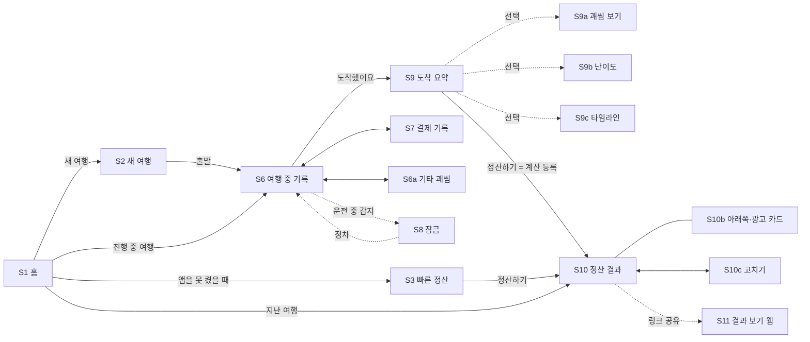

# 화면 명세

> 사용성 원칙과 화면별 동작 규칙. 시각 참고는 mockups/final.html.

## 사용성 원칙

차 안, 친구 사이, 돈 이야기라는 세 조건에서 쓰기 쉽고 민망하지 않아야 합니다.

| 원칙                               | 적용                                                                                          |
|------------------------------------|-----------------------------------------------------------------------------------------------|
| 출발 전 입력은 2개                 | 도착지와 동승자만. 구간·운전자·좌석은 기록에서 자동, 차량·규칙은 기본값(S2)                   |
| 고치기는 결과를 보면서             | 결과 화면에서 값을 고치면 금액이 바로 바뀜. 무엇이 기본값인지 표시(S10c)                      |
| 차 안 입력은 한 번 탭              | 괘씸·감면 타일은 탭하면 +1, 길게 누르면 −1. 누적 횟수를 타일에 크게 표시(S6)                  |
| 운전자는 화면을 보지 않는다        | 운전 중 잠금(S8). 큰 숫자는 동승자 기준. 음성 기록은 2차 조건부                               |
| 광고는 흐름을 막지 않는다          | 계산 등록 1회당 결과 화면 맨 아래 광고 카드 1개. 대기 시간·전면 화면·자동 재생 없음           |
| 보내는 사람이 민망하지 않게        | 말투 3종(기본 순한맛), 명분 문구, 받는 사람 페이지에는 광고 없음                              |
| 받는 사람은 3초 안에 금액 확인     | 결과 페이지(S11)는 사람별 금액부터. 설치·로그인 없음. 송금 버튼(등록 시)                      |
| 변수는 기록만 하면 계산이 따라온다 | 하차·합류·운전 교대 버튼 → 구간 자동 분할. 휴식 버튼 → 운전 시간 제외. 결제 기록 → 낸 돈 차감 |
| 밤에는 어둡게                      | 폰 다크 모드 또는 18~06시 야간 모드. 검정 배경, 낮은 밝기(S6N, S8N)                           |

### 입력 최소화

| 단계                 | 필수 입력                                | 선택                                        |
|----------------------|------------------------------------------|---------------------------------------------|
| 출발 전 (S2)         | 도착지 검색, 동승자 칩, “출발” 탭        | 출발지 변경                                 |
| 여행 중 (S6)         | “도착했어요” 탭                          | 괘씸·감면, 결제, 하차·합류, 운전 교대, 휴식 |
| 도착 후 (S9)         | “정산하기” 탭                            | 기상·체감 칩, 괘씸·타임라인·난이도 보기     |
| 결과 (S10)           | “결과 링크 공유” 탭                      | 말투, 고치기(S10c)                          |
| 앱을 못 켠 여행 (S3) | 도착지, 인원, 출발·도착 시각, “정산하기” | 휴식 시간                                   |

필수 탭은 여행 한 건에 약 5회입니다. 기록을 하나도 하지 않고 출발·도착만 눌러도 정산이 됩니다.

#### 기본값

| 항목               | 기본값                             | 바꾸는 곳                   |
|--------------------|------------------------------------|-----------------------------|
| 출발지             | 최근 출발지 또는 저장한 “집”       | S2                          |
| 운전자·좌석        | 차주(나), 좌석 미지정              | 여행 중 운전 교대·좌석 변경 |
| 차량 유종·연비     | 휘발유, 12km/L (한 번 고치면 기억) | S10c                        |
| 노동비 방식·시급   | 시급형, 해당 연도 최저시급         | S10c                        |
| 괘씸모드·반영 방식 | 켜짐, 가산형                       | 설정                        |
| 말투               | 순한맛                             | S10                         |
| 기상·체감          | 맑음, 보통                         | S9 칩                       |
| 동승자 이름        | “+1명”이면 동승자 A, B…            | S10c                        |

결과 영수증에는 기본값으로 계산한 항목(연비, 시급 등)에 “기본값” 표시를 붙여 받는 사람도 추정치임을 알 수 있게 합니다.

#### 감수하는 점

- 경유지를 미리 넣지 않아 경로 조회는 출발지→도착지 한 번이다. 크게 돌아간 여행은 거리가 짧게 잡힐 수 있어 결과 화면에서 거리 고치기를 안내한다.
- 하차 장소를 고르지 않으면 구간 거리는 운전 시간 비율 추정이다.
- 첫 여행은 기본 연비라 기름값이 실제와 다를 수 있다. 한 번 고치면 다음부터 정확해진다.
- 구간마다 경로를 조회하지 않아 카카오 API 호출이 줄어, 0원 운영에는 유리하다.

### 영수증 말투

말투는 영수증 제목, 괘씸 사유 문장, 공유 본문, 명분 문구만 바꿉니다. 금액과 “송금 전에 확인하세요” 안내는 모든 말투에서 같습니다.

| 말투          | 괘씸 사유 예                                 | 공유 문구 예                     | 명분 문구                                               |
|---------------|----------------------------------------------|----------------------------------|---------------------------------------------------------|
| 순한맛 (기본) | 조수석에서 푹 쉬었어요 (+3)                  | 강릉 여행 운전 정산이 도착했어요 | 이 정산금은 운전자의 다음 기름값과 허리 건강에 쓰입니다 |
| 매운맛        | 조수석에서 60분 숙면. 내비는 누가 봤죠? (+3) | 괘씸자 1명 감지됨 🚨 정산 도착   | 운전자는 오늘 사람이 아니라 내비였습니다                |
| 비즈니스      | 조수석 휴식 60분 (+3)                        | 강릉 이동 운전 정산 내역입니다   | 표시하지 않음                                           |

### 음성 기록 (2차 조건)

- 기기 내부 음성 인식이 가능한 환경에서만 켠다. 서버 기반 인식은 음성이 외부로 전송되므로 쓰지 않는다.
- 계속 듣지 않고, 버튼을 누르는 동안만 듣는다. 동승자가 누르는 것을 기본으로 한다.
- “괘씸 태호 시끄러움”처럼 정해진 짧은 명령만 기록하고, 확인은 도착 후 S9에서 한다. 운전 중 확인 화면은 띄우지 않는다.

### 송금 버튼 (출시 직후)

- 운전자가 자기 토스 아이디 링크나 카카오페이 송금 링크를 한 번 등록하면 폰에 저장되고 결과 링크에 담긴다.
- 허용 형식이 아닌 주소, 계좌번호 원문은 저장·표시하지 않는다.
- 금액 자동 입력이 안 되는 경우를 대비해 “금액 복사” 버튼을 함께 둔다.

## MVP 화면 범위

1부 서비스 기획과 2부 시스템·운영 설계를 기준으로 합니다. 한 폰 입력 구조라 로그인, 멤버 초대, 투표 화면은 없고, 서버 최소 정보 원칙에 따라 기기의 현재 위치를 서버로 보내는 화면도 없습니다. 앱은 Cloudflare Worker가 서빙하는 PWA를 가정하지만 네이티브로 옮겨도 화면 구성은 같습니다.

| ID   | 화면                  | 목적                                      | 핵심 요소                                                                                            |
|------|-----------------------|-------------------------------------------|------------------------------------------------------------------------------------------------------|
| S1   | 홈                    | 진행 중·지난 여행, 새 여행·빠른 정산 시작 | 진행 중 여행 카드, 지난 여행 목록, 새 여행 버튼, 빠른 정산 링크                                      |
| S2   | 새 여행               | 출발 전 필수 입력 2개                     | 도착지 검색, 동승자 칩(+1명), 기본값 한 줄 요약, 출발 버튼                                           |
| S3   | 빠른 정산             | 앱을 못 켠 여행을 바로 정산               | 도착지, 인원, 출발·도착 시각, 휴식                                                                   |
| S6   | 여행 중 기록          | 주행 중 사건을 탭으로 기록                | 현재 구간(큰 글자), 결제·하차·합류·운전 교대·휴식, 괘씸·감면(길게 누르면 −1), 기타, 좌석 변경        |
| S6a  | 기타 괘씸 기록        | 점수표에 없는 괘씸 행동 기록              | 대상, 메모(폰에만 저장), 구간당 남은 횟수                                                            |
| S7   | 결제 기록             | 누가 무엇을 냈는지 반영                   | 종류(주유·통행료·주차·기타), 금액, 결제한 사람, 주유 단가·주유량                                     |
| S8   | 운전 중 잠금          | 입력 담당이 운전 중일 때 조작 차단        | 잠금 안내, 동승자에게 폰 넘기기, 정차 후 해제                                                        |
| S9   | 도착 요약             | 자동 계산값 한 장 확인 후 정산            | 운전 시간·인원·괘씸·난이도 요약, 기상·체감 칩(선택), 상세 보기 링크, 정산하기                        |
| S9a  | 괘씸 기록 보기 (선택) | 이의가 있을 때만 확인                     | 구간별 괘씸 항목, 체크 해제, 용서하기                                                                |
| S9b  | 난이도 상세 (선택)    | 난이도 요소 확인·수정                     | 자동 운전 시간, 기상, 체감, 요소별 가산, 노동비 비교                                                 |
| S9c  | 여행 타임라인 (선택)  | 자동 생성된 구간 확인·보완                | 시각별 하차·합류·교대·결제, 하차 장소 선택, 기록 추가                                                |
| S10  | 정산 결과             | 누가 누구에게 얼마 보낼지 확인·공유       | 받을 돈(큰 글자), 말투 선택, 명분 문구, 사람별 보낼 돈, 기본값 안내·고치기, 결과 링크 공유           |
| S10b | 정산 결과 · 아래쪽    | 계산 근거 확인, 광고 카드 1개             | 구간별 계산 근거, 낸 돈·몫·차액, 닫을 수 있는 광고 카드(계산 등록 1회)                               |
| S10c | 고치기                | 결과를 보면서 값 수정                     | 이름, 운전 시간, 거리, 연비, 시급, 유가, 기상 · 기본값/자동/직접 입력 표시                           |
| S11  | 결과 보기(웹)         | 링크 받은 사람이 앱 없이 확인             | 사람별 금액 목록(큰 글자), 계산 근거 펼치기, 송금 버튼(등록 시), 받는 사람 확인 안내, 고정 안내 문구 |
| S6N  | 여행 중 기록 · 야간   | 야간 운전 시야 방해 최소화                | 검정 배경, 낮은 밝기, 큰 숫자 유지                                                                   |
| S8N  | 운전 중 잠금 · 야간   | 잠금 화면이 밤에 눈부시지 않게            | 검정 배경, 작은 아이콘, 어두운 버튼                                                                  |

## 화면 흐름

필수 경로는 S2 → S6 → S9 → S10 네 화면, 필수 탭은 약 5회입니다. 점선으로 이어진 화면은 필요할 때만 엽니다.

## 화면별 동작 규칙

### — 시작 —

#### S1 홈

앱을 열면 진행 중인 여행이 맨 위에 옵니다. 여행 중에 앱을 다시 열었을 때 한 번에 기록 화면(S6)으로 돌아가는 것이 이 화면의 가장 중요한 일입니다.

##### 동작

- 진행 중 카드 탭 → S6, 지난 여행 탭 → S10(결과 다시 보기, 링크 재공유)
- “빠른 정산 ›” → S3. 기록 없이 끝난 여행도 바로 정산
- 진행 중 여행은 한 번에 하나만. 새 여행을 만들려 하면 기존 여행 종료 여부를 묻습니다.
- 지난 여행 길게 누르기 → 복제(같은 멤버·경로로 새 여행), 삭제

##### 빈 상태

“아직 여행이 없어요. 출발지와 도착지만 넣으면 운전자 몫을 계산해 드려요.”와 새 여행 버튼만 표시.

#### S2 새 여행

출발 전 입력은 이 한 화면, 필수 값은 도착지와 동승자 2개입니다. 경유지·구간·운전자·차량·정산 규칙은 묻지 않습니다.

##### 동작

- 도착지: 탭하면 검색(`GET /api/places`, 서버에는 검색어만). 최근 목적지 먼저 표시
- 출발지: 최근 출발지 또는 저장한 “집”이 기본값. 기기 현재 위치로 채우지 않음
- 동승자: 최근 함께한 사람 칩 탭으로 선택. 이름을 모르면 “+1명” → 동승자 A, B… 이름은 결과 화면에서 변경
- “출발” 탭 → 출발 시각 기록, 출발지→도착지 경로 1회 조회(오프라인이면 연결 시 재시도), S6로 이동
- 기본값 한 줄: 차량·노동비 방식·괘씸모드. 탭하면 설명만 보여주고 수정은 결과 화면(S10c)에서

##### 검증

도착지가 비어 있으면 출발 버튼 비활성, “어디로 가는지 알려주세요.” 동승자를 안 골라도 출발 가능(나 혼자 운전 기록).

#### S3 빠른 정산

여행 중 앱을 켜지 못했거나 기록이 귀찮았던 여행을 위한 입구입니다. 기록이 없다는 이유로 정산을 포기하지 않게 합니다.

##### 동작

- 필수 값: 도착지, 인원, 출발·도착 시각. 출발지는 S2와 같은 기본값
- 인원은 스테퍼. 이름 대신 동승자 A, B, C로 생성, 운전자는 나
- 시각은 오늘 기준, 날짜를 바꾸면 지난 날짜도 가능. 휴식은 칩 3개 중 선택
- “정산하기” → 경로 1회 조회 후 S10. 계산 등록으로 광고 규칙은 일반 여행과 같음
- 결과 화면 S10c에서 이름·결제·괘씸·중간 하차를 뒤늦게 추가 가능

### — 여행 중 —

#### S6 여행 중 기록

흔들리는 차 안에서 동승자가 들고 쓰는 화면입니다. 현재 구간과 누적 횟수를 크게 보여주고, 모든 기록은 탭 한 번으로 끝납니다.

##### 동작

- 괘씸·감면 타일 탭 → +1 즉시 기록, 하단 토스트 “태호 시끄러움 +1 · 취소”(5초)
- 타일 길게 누르기 → −1(짧은 진동). 누적 횟수는 타일 안에 큰 숫자로 표시
- 대상 칩 → 현재 구간 탑승자 중 선택, 마지막 선택 유지
- 조수석 수면은 탭으로 타이머 시작·종료, 20분당 +1. 누른 사람을 조수석으로 자동 지정(좌석은 미리 묻지 않음)
- “결제” → S7. “하차·합류” → 사람 선택, 그 시각에 구간 자동 분할(시각은 폰에만 기록)
- “운전 교대” → 새 운전자 탭, 그 시각부터 운전자 변경과 구간 분할. “휴식” → 켜는 동안의 시간은 운전 시간에서 제외
- 아무것도 누르지 않아도 됨. 출발·도착 탭만으로 정산 가능
- “기타” → S6a, 구간당 남은 횟수 표시. “좌석 변경” → 둘이 타는데 뒷자리로 바뀌면 “택시모드가 적용돼요” 토스트
- 괘씸모드가 꺼져 있으면 괘씸·감면 영역 대신 결제·하차 기록만 표시. 야간에는 S6N 스타일

#### S6a 기타 괘씸 기록

점수표는 고정하되 “이건 표에 없는데 괘씸하다”는 순간을 받아주는 보조 시트입니다. 점수 남발과 링크 악용을 막는 제한이 화면에 그대로 보이게 합니다.

##### 동작

- 대상은 S6에서 선택한 사람이 기본값, 현재 구간 탑승자 중 변경 가능
- 메모 최대 20자, 비워 두어도 기록 가능. 점수는 +1 고정으로 선택지 없음
- 구간당 2회 제한. 남은 횟수를 시트와 S6 타일에 함께 표시
- 메모는 폰(IndexedDB)에만 저장. S9 확인 화면에서는 보이고, 결과 링크·결과 이미지에는 “기타”로만 표시

#### S7 결제 기록

S6의 “결제 기록”에서 여는 바텀시트입니다. 기름값뿐 아니라 통행료·주차비를 동승자가 먼저 낸 경우까지 한곳에서 받습니다.

##### 동작

- 종류 탭: 주유는 주유소·단가·주유량(또는 금액), 통행료·주차·기타는 금액과 메모만
- 결제한 사람은 필수. 정산에서 사람별 “낸 돈 − 자기 몫”으로 차액을 계산해 최소 송금 목록을 만듦
- 주유소는 검색어로 찾거나 직접 입력. 현재 위치로 자동 채우지 않음
- 주유 단가는 이후 구간 유류비에 적용. 정밀 모드(탱크 잔량 가중평균)는 설정에서 켤 때만
- 기록은 S9c 타임라인에 “💳 주유 49,500원 · 민수 결제”로 표시

#### S8 운전 중 잠금

입력 담당 폰이 곧 운전자 폰인 경우가 많아서 안전 장치는 MVP에 포함합니다. 기록을 막되, 동승자에게 폰을 넘기는 길은 열어둡니다.

##### 표시 조건

- 현재 구간 운전자가 입력 담당 본인으로 지정되어 있고
- 위치 권한이 있고, 최근 10초 평균 속도가 시속 10km 이상일 때

##### 동작

- “동승자가 기록할게요” → 탑승자 이름 선택 → 해당 구간 동안 잠금 해제(구간이 바뀌면 다시 확인)
- 속도가 60초 이상 0에 가까우면(정차) 자동 해제
- 위치 권한이 없으면 잠금 대신 S6 상단에 “운전 중이라면 도착 후 기록하세요” 배너만 표시
- 속도는 폰 안에서만 계산하고 위치·속도 값은 저장하지도, 서버로 보내지도 않음. 권한 요청 문구: “운전 중 조작을 막는 데만 쓰고 저장하지 않아요.”

### — 도착 후 —

#### S9 도착 요약

S6의 “도착했어요” 한 번으로 열리는 화면입니다. 앱이 자동으로 채운 값을 한 장으로 보여주고, 사용자는 “정산하기”만 누르면 됩니다.

##### 자동으로 채우는 값

- 운전 시간 = 도착 탭 − 출발 탭 − 휴식. 인원·하차는 하차·합류 기록에서, 괘씸·결제는 여행 중 기록에서
- 난이도는 운전 시간·시각·경로 교통 정보로 계산. 기상·체감은 기본값(맑음·보통)

##### 선택 동작

- 날씨·체감 칩: 탭 한 번. 체감 3단계는 1·3·5점으로 저장(난이도 −0.1, 0, +0.1)
- “타임라인 ›” → S9c, “보기 ›” → S9a, “상세 ›” → S9b. 모두 필수 아님
- “정산하기” → 계산 등록, S10으로 이동

앞 설계의 “도착 후 확정” 두 탭(구간 수정·괘씸 확인)을 필수 단계에서 선택 링크로 바꾼 화면입니다.

#### S9a 괘씸 기록 보기 (선택)

S9 도착 요약의 “괘씸 4건 보기”로 엽니다. 기본은 기록 그대로 반영되므로, 이의가 있을 때만 들어오는 화면입니다. 기록 시각을 같이 보여줘서 “그때 진짜 잤잖아”라는 대화가 나오게 합니다.

##### 동작

- 체크 해제 → 점수에서 제외(이의 인정)
- 항목을 왼쪽으로 밀기 → “용서하기”. 해제와 달리 결과 영수증에 “용서함”으로 남음
- 하단 요약에 구간별 최종 괘씸 배수를 실시간 반영
- 기타 항목은 메모까지 보여줌(폰 화면이므로). 결과 링크로 넘어갈 때는 메모 제외

#### S9b 구간 수정 · 난이도

S9 도착 요약의 “상세 ›”로 여는 선택 화면입니다. 값은 대부분 자동으로 채워져 있고, 어떤 요소가 얼마를 올렸는지 막대로 보여줍니다. 예시는 강릉 여행과 별개인 “돌아오는 밤길” 여행입니다.

##### 동작

- 실제 운전 시간은 출발·도착 탭과 휴식 기록으로 자동 계산(“자동” 표시). 탭해서 고치면 “직접 입력”으로 바뀌고 요소 즉시 재계산
- 실제 운전 시간을 입력하기 전에는 정체를 경로 API 비율로 추정하고 “예상”으로 표시
- 기상은 맑음/비/눈 수동 선택. 위치 기반 기상 조회는 하지 않음(서버 최소 정보 원칙)
- 운전자 체감은 기본 3점(보통). S9의 3단계 칩과 연동되고, 이 화면에서만 5단계로 세밀하게 조정
- 요소는 가산이 큰 순서로 정렬, 0인 요소는 한 줄로 접음. 막대 길이는 각 요소의 최대치 대비 비율. 계수는 최소 1.0, 최대 2.0
- 직접 입력한 값에는 직접 입력 표시가 붙고 결과 영수증에도 그대로 전달

##### 표시하지 않는 것

급제동·급가속 같은 운전 행동 지표. 거친 운전이 더 받는 역보상을 막기 위해 정산 화면에 두지 않습니다.

#### S9c 여행 타임라인 (선택)

여행 중 누른 하차·합류·결제 기록을 시간순으로 보여주고, 하차·합류 지점에서 구간을 자동으로 나눕니다. 사람을 구간마다 지우고 추가하는 대신 “여기서 내렸다”만 확인하면 됩니다.

##### 동작

- 하차·합류 항목의 시각 탭 → 시각 수정, 장소 칩 → 장소 검색(서버에는 검색어만)
- 장소를 고르면 경로 재조회로 구간 거리 확정. 고르지 않으면 앞뒤 구간 운전 시간 비율로 거리 분할
- 나뉜 구간의 탑승자·운전자는 자동 반영되고 S9b 구간 수정 값에 이어짐
- “+ 하차·합류 추가”로 여행 중 깜빡한 하차·합류·운전 교대·휴식을 도착 후 넣을 수 있음
- S9 도착 요약의 “타임라인 ›”로 여는 선택 화면. 확인하지 않아도 자동 구간으로 정산됨
- 지도·현재 위치는 사용하지 않음(0원·서버 최소 정보 원칙)

#### S10 정산 결과

운전자가 받을 돈을 가장 크게 두고, 말투를 고르면 사유 문장과 공유 문구가 바로 바뀝니다. 금액은 말투와 무관하게 같습니다.

##### 동작

- 말투: 순한맛(기본)·매운맛·비즈니스 → 사유 문장, 명분 문구, 공유 본문 변경. 비즈니스는 명분 문구 숨김. 마지막 선택 기억
- “계산 근거” → 사람별 낸 돈·자기 몫·차액 표, 구간별 공통비·노동비·난이도·괘씸 배수·경로 조회 출처
- “결과 링크 공유” → Web Share API 본문에 말투별 문구(순한맛: “강릉 여행 운전 정산이 도착했어요”), 괘씸자는 이름 없이 인원수만
- “고치기 ›” 또는 금액 탭 → S10c. 기본값으로 계산한 항목이 있을 때 노란 안내 줄 표시
- 실제 운전 시간이 예상의 1.3배를 넘으면 안내 줄에 “경로보다 멀리 돌았나요? 거리 고치기”를 우선 표시
- ⋯ 메뉴 → 결과 이미지 저장, 계산 근거로 이동(S10b)
- 결제자가 여러 명이면 최소 송금 목록(누가 누구에게)으로 표시
- 링크 발급 후 수정하면 “이미 공유한 링크는 예전 결과예요. 새 링크를 공유하세요.” 배너
- S9 “정산하기”는 곧 계산 등록. 결과는 기다림 없이 즉시 표시되고, 광고는 스크롤 맨 아래(S10b)에만

#### S10b 정산 결과 · 아래쪽 (광고 카드)

S10을 끝까지 내렸을 때의 모습입니다. 이 앱의 유일한 광고가 계산 근거 다음, 화면 맨 아래에 한 번 붙습니다.

##### 광고 동작

- S9 “정산하기”로 계산을 처음 등록할 때 광고를 1번 요청. 결과는 기다리지 않고 먼저 표시
- 광고가 준비되면 콘텐츠 맨 끝에 붙어, 위의 금액·목록 위치가 움직이지 않음
- 하단 “결과 링크 공유” 버튼과 겹치지 않게 버튼 높이만큼 여백 확보(실수 클릭 방지)
- ✕ → 카드 제거, 이 여행에서는 다시 표시하지 않음
- 수정 후 재등록, 지난 여행 다시 보기, 재공유에는 광고 없음. 불러오기 실패 시 아무것도 표시하지 않음
- 결과 이미지 저장·공유 문구·받는 사람 페이지(S11)에는 광고를 넣지 않음. 야간 모드에서는 카드를 어둡게

##### 계산 근거

구간별 공통비·노동비·난이도·탑승 인원·경로 조회 출처와, 사람별 “낸 돈 − 자기 몫” 차액을 보여줍니다. 운전자는 받을 수고비(노동비)를 더해 계산합니다(민수: 40,000 − 11,500 + 29,412 = +57,912). 차액 합계는 항상 0입니다.

#### S10c 고치기

출발 전에 묻지 않은 값을 결과를 보면서 고치는 곳입니다. 뒤에 보이는 금액이 바로 바뀌어서, 무엇을 고쳐야 결과가 달라지는지 직접 확인할 수 있습니다.

##### 동작

- 각 값에 출처 표시: 기본값 앱이 가정한 값, 직접 입력 사용자가 고친 값, 자동·주유 기록 등 기록에서 온 값
- 연비: 숫자 입력 또는 차종 검색(공인연비). 한 번 고치면 다음 여행부터 기본값으로 기억
- 기준 시급·노동비 방식(시급형/택시형), 유가, 운전 시간, 거리 수정. 거리를 고치면 구간 거리 비율도 다시 계산
- “이름·결제·괘씸” → 동승자 A·B 이름 바꾸기, 뒤늦은 결제·괘씸·하차 추가(S7·S6a·S9c 재사용)
- 모든 수정은 즉시 자동 저장. 결과 링크를 이미 공유했다면 “새 링크를 공유하세요” 배너
- 기본값이 남아 있으면 결과 영수증과 받는 사람 페이지 계산 근거에 “기본값” 표시

#### S11 결과 보기 (받는 사람용 웹)

링크를 받은 사람의 질문은 “그래서 내가 얼마야?” 하나입니다. 열자마자 사람별 금액이 큰 글자로 보이고, 이름을 누르면 계산 근거가 펼쳐집니다.

##### 동작

- 링크 `#` 뒤 데이터를 브라우저에서만 해제해 렌더링. 서버 요청, 로그인, 설치 요구, 광고 없음
- 이름 탭 → 공통비·노동비·괘씸 가산·난이도 사유 펼침. 마지막으로 연 이름은 localStorage에 기억해 다음 방문 시 자동 펼침
- 송금 버튼은 운전자가 송금 링크를 등록한 경우에만 표시. 토스 아이디 링크·카카오페이 송금 링크 형식을 페이지가 다시 검증하고, 형식이 아니면 버튼을 숨김
- 계좌번호는 표시하지 않음. 금액 자동 입력이 안 되는 송금 앱을 위해 “금액 복사” 제공
- 링크 데이터 4KB·해제 32KB 초과, 멤버·금액 범위 이탈 시 손상 링크 화면. 모든 값은 텍스트로만 출력, 괘씸 사유는 코드값을 말투별 고정 문장으로 변환(기타는 “기타 +1”)
- 하단에 명분 문구(말투에 따름)와 고정 안내 문구

##### 오류

데이터가 깨진 링크: “링크가 잘렸거나 손상됐어요. 보낸 사람에게 링크를 다시 요청하세요.” 버전이 너무 새로운 링크: “새 버전 결과예요. 페이지를 새로고침하세요.”

### — 야간 모드 —

#### S6N 여행 중 기록 · 야간

S6와 구조는 같고 밝기만 바꿉니다. 조수석에서 폰을 켜도 운전자 시야에 빛이 번지지 않게 하는 것이 목표입니다.

##### 전환 조건

- 폰이 다크 모드면 항상 야간 모드
- 폰 설정이 라이트여도 18:00~06:00에는 자동 전환. 일몰 시각 계산은 위치가 필요해 쓰지 않음
- 설정에서 “항상 켜기 / 자동 / 끄기” 수동 선택 가능

##### 표현 규칙

- 배경은 완전 검정(OLED에서 픽셀이 꺼짐), 카드는 거의 검정
- 텍스트는 흰색 대신 낮은 밝기의 회색, 초록·빨강은 채도를 낮춤
- 현재 구간 이름과 누적 숫자의 크기는 주간과 동일하게 유지
- 토스트·시트도 같은 어두운 색. 흰 배경 팝업을 띄우지 않음

#### S8N 운전 중 잠금 · 야간

주간 S8은 초록 전체 화면이라 밤에는 가장 눈부신 화면이 됩니다. 야간에는 거의 빛을 내지 않는 잠금 화면으로 바꿉니다.

##### 표현 규칙

- 완전 검정 배경, 아이콘은 작게, 문구는 두 줄로 줄임
- 설명 박스를 없애고 “정차하면 자동으로 풀려요” 한 줄만
- 버튼은 어두운 황색 테두리와 낮은 밝기의 글자
- 잠금이 걸릴 때 진동·소리 없음

표시 조건과 해제 동작은 S8과 같습니다.

## 공통 UI 규칙

- **터치 영역:** 차 안 사용을 전제로 모든 버튼 최소 48×48px, 주요 버튼은 화면 하단 고정.
- **자동 저장:** 모든 입력은 즉시 폰에 저장. 저장 버튼은 두지 않고, 되돌리기는 토스트의 “취소”로.
- **금액 표기:** 천 단위 쉼표, “원” 붙임. 자동 조회 값과 직접 입력 값을 구분 표시(직접 입력에 작은 연필 표시).
- **색의 의미:** 초록은 확정·기본 동작, 노랑은 주의·진행 중, 빨강은 괘씸 가산에만 씁니다. 오류 표시에 빨강을 쓰지 않아 괘씸과 헷갈리지 않게 합니다(오류는 노랑 박스 + 아이콘).
- **오프라인:** 산길·터널에서 조회가 실패해도 기록은 계속 가능. 조회는 연결되면 자동 재시도하고, 그 전까지 “조회 대기” 표시.
- **접근성:** 괘씸 타일은 이모지와 텍스트를 함께 표기, 색만으로 상태를 전달하지 않음. 글자 크기 확대 시 괘씸 타일은 4열 → 2열, 감면 타일은 3열 → 2열로.
- **큰 숫자:** 동승자가 보는 핵심 숫자(S6 현재 구간, S10 받을 돈, S11 사람별 금액)는 24px 이상. 운전자가 흘끗 보도록 설계하지 않음.
- **되돌리기:** 기록은 토스트 “취소”(5초) 또는 길게 눌러 −1. 삭제 확인 팝업은 띄우지 않음.
- **야간 모드:** 폰 다크 모드 또는 18~06시 자동. 모든 화면과 시트, 토스트에 적용.
- **광고:** 계산 등록 1회당 S10 맨 아래 카드 한 곳에서만. 대기 화면·전면 광고·다른 화면 배너를 두지 않음.
- **자동 조회 한도:** 팝업으로 막지 않고 입력 필드 위 안내 문구 + 수동 입력 필드 자동 펼침.
- **입력 최소화:** 출발 전 필수 입력은 도착지·동승자 2개. 새로 묻고 싶은 값이 생기면 기본값 + S10c 고치기로 넣고, 출발 전 화면에 필드를 추가하지 않음.
- **기본값 표시:** 앱이 가정한 값은 어디서든 “기본값” 태그로 구분.
- **서버 최소 정보:** 화면 어디에도 기기 현재 위치를 서버로 보내는 기능을 두지 않음. 새 화면 추가 시 서버로 가는 값을 기획서 표와 대조.

## MVP에서 뺀 화면

| 화면                                    | 뺀 이유                                                                                                                                           | 시점      |
|-----------------------------------------|---------------------------------------------------------------------------------------------------------------------------------------------------|-----------|
| GPS·센서 주행 기록                      | 배터리·권한 설계, 위치정보법 검토 필요. PWA는 화면이 켜진 동안만 측정되고 거치 위치에 따라 값이 흔들림. 정산에는 반영하지 않고 운전자 본인 기록용 | 2차       |
| 출발 시각 기준 난이도 예측              | 미래 운행 정보 길찾기 API 호출량을 하드 상한 설계에 포함해야 함                                                                                   | 2차       |
| 주변 주유소 가격 비교                   | 오피넷 좌표 변환 검증 필요, 주유 기록은 수동으로 충분                                                                                             | 2차       |
| 영수증 사진 인식                        | OCR 비용·정확도 검증 필요                                                                                                                         | 2차       |
| 송금 링크 등록 화면                     | 송금 링크 형식·금액 자동 입력 확인 필요. 결과 페이지 버튼(S11)은 등록 기능과 함께 출시                                                            | 출시 직후 |
| 음성 기록                               | 기기 내부 인식 환경 확인 필요, 누를 때만 듣는 방식으로 설계                                                                                       | 2차       |
| 전면·대기 화면·동영상 광고              | 결과를 가리거나 기다리게 해 사용성을 해침. 웹(PWA)에서는 앱 전용 형식도 불가                                                                      | 계획 없음 |
| 여행 백업·복원                          | 파일 내보내기 형식 확정 필요                                                                                                                      | 2차       |
| 현재 위치로 검색                        | 서버 최소 정보 원칙                                                                                                                               | 계획 없음 |
| 출발 전 경로·구간·운전자·정산 규칙 설정 | 여행 중 기록과 기본값, 결과 화면 고치기(S10c)로 대체                                                                                              | 계획 없음 |
| 결과별 카카오톡 썸네일                  | \# 뒤 결과 데이터를 서버가 볼 수 없어 기술적으로 불가                                                                                             | 계획 없음 |
| 괘씸 점수표 편집                        | 고정 점수표 + 기타 항목으로 확정                                                                                                                  | 계획 없음 |
| 누적 통계(올해 운전 시간)               | 여행이 쌓인 뒤에 의미가 있음                                                                                                                      | 3차       |
